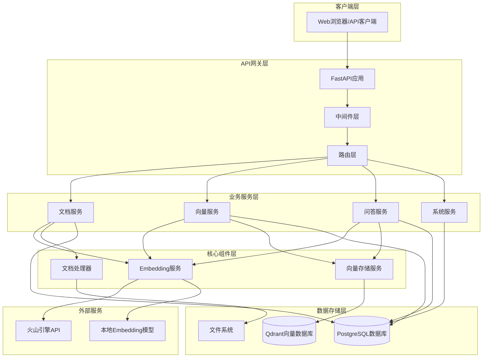
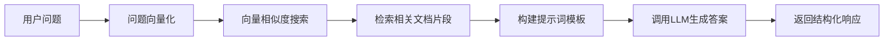
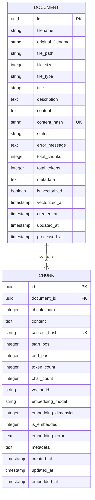

# RAG系统技术设计文档

## 1. 系统架构设计

### 1.1 整体架构

RAG系统采用分层架构设计，包含表示层、业务逻辑层、数据访问层和存储层：



### 1.2 组件关系

- **API层**: FastAPI框架提供RESTful接口，处理HTTP请求和响应
- **服务层**: 业务逻辑封装，包含文档管理、向量化、问答等核心功能
- **数据层**: PostgreSQL存储结构化数据，Qdrant存储向量数据
- **外部服务**: 火山引擎提供LLM能力，本地模型提供embedding能力

### 1.3 数据流向

1. **文档上传流程**: 客户端 → API → 文档服务 → 文件系统 → 数据库
2. **向量化流程**: 文档服务 → 向量服务 → Embedding服务 → 向量存储
3. **问答流程**: 客户端 → API → 问答服务 → 向量检索 → LLM生成 → 响应

## 2. 核心功能实现详解

### 2.1 文档上传和处理流程

#### 2.1.1 设计思路
文档处理采用异步处理模式，支持多种文档格式，确保系统的可扩展性和稳定性。

#### 2.1.2 技术实现

**文档上传接口**:
```python
@router.post("/upload", response_model=DocumentUploadResponse)
async def upload_document(
    file: UploadFile = File(...),
    title: Optional[str] = Form(None),
    description: Optional[str] = Form(None),
    document_service: DocumentService = Depends(get_document_service)
):
```

**核心处理逻辑**:
1. **文件验证**: 检查文件类型、大小限制
2. **内容提取**: 使用PyPDF2提取PDF文本内容
3. **哈希计算**: 生成内容哈希避免重复上传
4. **数据库存储**: 保存文档元数据到PostgreSQL
5. **文件存储**: 将原始文件保存到本地文件系统

**关键代码片段**:
```python
# 计算文件哈希
content_hash = hashlib.sha256(content.encode()).hexdigest()

# 检查重复文档
existing_doc = db.query(Document).filter(
    Document.content_hash == content_hash
).first()

# 保存文档记录
document = Document(
    filename=safe_filename,
    original_filename=file.filename,
    file_path=file_path,
    file_size=file_size,
    file_type=file_type,
    title=title,
    description=description,
    content=content,
    content_hash=content_hash,
    status="completed"
)
```

#### 2.1.3 配置参数
- `UPLOAD_DIR`: 文件上传目录
- `MAX_FILE_SIZE`: 最大文件大小限制
- `ALLOWED_EXTENSIONS`: 允许的文件扩展名

### 2.2 文档向量化的算法和流程

#### 2.2.1 设计思路
采用分块向量化策略，将长文档切分为语义相关的片段，提高检索精度和效率。

#### 2.2.2 技术实现

**分块策略**:
```python
def chunk_text(self, text: str, chunk_size: int = 1000, 
               overlap: int = 200) -> List[Dict]:
    """
    智能文本分块
    - 按段落优先分割
    - 保持语义完整性
    - 支持重叠窗口
    """
```

**向量化流程**:
1. **文档分块**: 将长文档按语义边界切分
2. **批量向量化**: 使用embedding模型生成向量
3. **向量存储**: 将向量保存到Qdrant数据库
4. **状态更新**: 更新数据库中的向量化状态

**Embedding服务实现**:
```python
class EmbeddingService:
    def __init__(self):
        self.use_api = settings.embedding_use_api
        if self.use_api:
            self.client = OpenAI(
                api_key=settings.volcengine_api_key,
                base_url=settings.volcengine_base_url
            )
        else:
            self.model = SentenceTransformer(settings.embedding_model_name)
    
    def get_embedding(self, text: str) -> Tuple[List[float], Dict]:
        if self.use_api:
            return self._get_api_embedding(text)
        else:
            return self._get_local_embedding(text)
```

#### 2.2.3 性能优化
- **批量处理**: 支持批量向量化减少API调用
- **缓存机制**: 避免重复计算相同文本的向量
- **异步处理**: 大文档向量化采用异步模式

### 2.3 语义搜索的实现机制

#### 2.3.1 设计思路
基于向量相似度的语义搜索，支持多种相似度计算方法和过滤条件。

#### 2.3.2 技术实现

**搜索流程**:
1. **查询向量化**: 将用户查询转换为向量
2. **相似度计算**: 在Qdrant中进行向量相似度搜索
3. **结果过滤**: 根据阈值和文档ID过滤结果
4. **结果排序**: 按相似度分数排序返回

**核心搜索算法**:
```python
def search_similar_chunks(self, query: str, 
                        limit: int = 10,
                        score_threshold: float = None,
                        document_ids: List[int] = None) -> List[Dict]:
    # 1. 生成查询向量
    query_vector, _ = self.embedding_service.get_embedding(query)
    
    # 2. 构建过滤条件
    filter_conditions = {}
    if document_ids:
        filter_conditions["document_id"] = {"$in": document_ids}
    
    # 3. 向量搜索
    search_results = self.vector_store.search_vectors(
        query_vector=query_vector,
        limit=limit,
        score_threshold=score_threshold,
        filter_conditions=filter_conditions
    )
    
    return search_results
```

#### 2.3.3 搜索优化策略
- **预过滤**: 支持按文档ID、时间范围等条件预过滤
- **分数阈值**: 设置相似度阈值过滤低质量结果
- **结果重排**: 基于多种因素对搜索结果重新排序

### 2.4 RAG问答系统的工作原理

#### 2.4.1 设计思路
结合检索和生成两个阶段，先检索相关文档片段，再基于上下文生成答案。

#### 2.4.2 技术实现

**RAG问答流程**:


**核心问答逻辑**:
```python
def answer_question(self, question: str, 
                   document_ids: List[int] = None,
                   context_size: int = 2) -> Dict:
    # 1. 检索相关文档片段
    search_results = self.vector_service.search_similar_chunks(
        query=question,
        limit=context_size * 3,
        document_ids=document_ids
    )
    
    # 2. 构建上下文
    context_chunks = []
    for result in search_results[:context_size]:
        context_chunks.append({
            "content": result["content"],
            "source": result["document_filename"],
            "score": result["score"]
        })
    
    # 3. 构建提示词
    context_text = "\n\n".join([chunk["content"] for chunk in context_chunks])
    prompt = f"""基于以下文档内容回答问题：

文档内容：
{context_text}

问题：{question}

请基于上述文档内容回答问题，如果文档中没有相关信息，请说明无法从提供的文档中找到答案。"""
    
    # 4. 调用LLM生成答案
    response = self.llm_client.chat.completions.create(
        model=settings.llm_model_name,
        messages=[{"role": "user", "content": prompt}],
        temperature=0.7,
        max_tokens=1000
    )
    
    return {
        "answer": response.choices[0].message.content,
        "sources": context_chunks,
        "confidence": self._calculate_confidence(search_results)
    }
```

#### 2.4.3 提示词工程
- **上下文构建**: 智能选择最相关的文档片段
- **模板设计**: 设计有效的提示词模板引导LLM生成
- **答案质量控制**: 通过提示词约束答案格式和质量

### 2.5 系统监控和健康检查的实现

#### 2.5.1 设计思路
多维度监控系统状态，包括数据库连接、向量存储、外部服务等关键组件。

#### 2.5.2 技术实现

**健康检查接口**:
```python
@router.get("/health", response_model=HealthCheckResponse)
async def health_check():
    health_status = {
        "database": check_database_connection(),
        "vector_store": check_vector_store_connection(),
        "embedding_service": check_embedding_service(),
        "llm_service": check_llm_service()
    }
    
    overall_status = "healthy" if all(health_status.values()) else "unhealthy"
    
    return {
        "status": overall_status,
        "components": health_status,
        "timestamp": datetime.utcnow(),
        "uptime": time.time() - start_time
    }
```

**系统统计信息**:
```python
def get_system_stats() -> Dict:
    return {
        "database_stats": {
            "total_documents": db.query(Document).count(),
            "processed_documents": db.query(Document).filter(
                Document.status == "completed"
            ).count(),
            "total_chunks": db.query(Chunk).count(),
            "vectorized_chunks": db.query(Chunk).filter(
                Chunk.is_embedded == 1
            ).count()
        },
        "vector_store_stats": self.vector_store.get_collection_info(),
        "service_stats": {
            "embedding_model": self.embedding_service.model_name,
            "llm_model": settings.llm_model_name,
            "api_calls_today": self._get_api_usage_stats()
        }
    }
```

## 3. 数据模型设计

### 3.1 数据库表结构

#### 3.1.1 文档表 (documents)
```sql
CREATE TABLE documents (
    id UUID PRIMARY KEY DEFAULT gen_random_uuid(),
    filename VARCHAR(255) NOT NULL,
    original_filename VARCHAR(255) NOT NULL,
    file_path VARCHAR(500) NOT NULL,
    file_size INTEGER NOT NULL,
    file_type VARCHAR(50) NOT NULL,
    title VARCHAR(500),
    description TEXT,
    content TEXT,
    content_hash VARCHAR(64) UNIQUE,
    status VARCHAR(20) DEFAULT 'pending',
    error_message TEXT,
    total_chunks INTEGER DEFAULT 0,
    total_tokens INTEGER DEFAULT 0,
    metadata TEXT,
    is_vectorized BOOLEAN DEFAULT FALSE,
    vectorized_at TIMESTAMP WITH TIME ZONE,
    created_at TIMESTAMP WITH TIME ZONE DEFAULT NOW(),
    updated_at TIMESTAMP WITH TIME ZONE DEFAULT NOW(),
    processed_at TIMESTAMP WITH TIME ZONE
);
```

#### 3.1.2 分块表 (chunks)
```sql
CREATE TABLE chunks (
    id UUID PRIMARY KEY DEFAULT gen_random_uuid(),
    document_id UUID REFERENCES documents(id) ON DELETE CASCADE,
    chunk_index INTEGER NOT NULL,
    content TEXT NOT NULL,
    content_hash VARCHAR(64) UNIQUE,
    start_pos INTEGER,
    end_pos INTEGER,
    token_count INTEGER DEFAULT 0,
    char_count INTEGER DEFAULT 0,
    vector_id VARCHAR(100),
    embedding_model VARCHAR(100),
    embedding_dimension INTEGER,
    is_embedded INTEGER DEFAULT 0,
    embedding_error TEXT,
    metadata TEXT,
    created_at TIMESTAMP WITH TIME ZONE DEFAULT NOW(),
    updated_at TIMESTAMP WITH TIME ZONE DEFAULT NOW(),
    embedded_at TIMESTAMP WITH TIME ZONE
);
```

### 3.2 数据关系设计



### 3.3 索引设计

**性能优化索引**:
```sql
-- 文档表索引
CREATE INDEX idx_documents_content_hash ON documents(content_hash);
CREATE INDEX idx_documents_status ON documents(status);
CREATE INDEX idx_documents_is_vectorized ON documents(is_vectorized);
CREATE INDEX idx_documents_created_at ON documents(created_at DESC);

-- 分块表索引
CREATE INDEX idx_chunks_document_id ON chunks(document_id);
CREATE INDEX idx_chunks_content_hash ON chunks(content_hash);
CREATE INDEX idx_chunks_is_embedded ON chunks(is_embedded);
CREATE INDEX idx_chunks_vector_id ON chunks(vector_id);
```

## 4. API接口设计

### 4.1 RESTful API设计原则

- **资源导向**: 以资源为中心设计URL结构
- **HTTP动词**: 正确使用GET、POST、PUT、DELETE
- **状态码**: 合理使用HTTP状态码表示操作结果
- **版本控制**: 通过URL路径进行API版本管理

### 4.2 路由结构

```
/api/v1/
├── documents/          # 文档管理
│   ├── POST /upload   # 上传文档
│   ├── GET /list      # 文档列表
│   ├── GET /{id}      # 文档详情
│   └── DELETE /{id}   # 删除文档
├── vectors/           # 向量管理
│   ├── POST /vectorize # 向量化
│   ├── GET /search    # 向量搜索
│   └── GET /stats     # 向量统计
├── qa/                # 问答功能
│   ├── POST /ask      # 提问
│   ├── GET /ask       # GET方式提问
│   └── POST /batch    # 批量提问
└── system/            # 系统管理
    ├── GET /health    # 健康检查
    ├── GET /stats     # 系统统计
    └── GET /info      # 系统信息
```

### 4.3 中间件设计

**请求日志中间件**:
```python
@app.middleware("http")
async def log_requests(request: Request, call_next):
    start_time = time.time()
    
    # 记录请求信息
    logger.info(f"请求开始: {request.method} {request.url}")
    
    response = await call_next(request)
    
    # 记录响应信息
    process_time = time.time() - start_time
    logger.info(f"请求完成: {response.status_code}, 耗时: {process_time:.2f}s")
    
    return response
```

**CORS中间件**:
```python
app.add_middleware(
    CORSMiddleware,
    allow_origins=settings.ALLOWED_ORIGINS,
    allow_credentials=True,
    allow_methods=["*"],
    allow_headers=["*"],
)
```

## 5. 技术栈选择和配置

### 5.1 核心技术栈

| 组件 | 技术选择 | 选择理由 |
|------|----------|----------|
| Web框架 | FastAPI | 高性能、自动文档生成、类型提示支持 |
| 数据库 | PostgreSQL | 成熟稳定、支持复杂查询、ACID特性 |
| 向量数据库 | Qdrant | 高性能向量搜索、易于部署、丰富的过滤功能 |
| Embedding模型 | SentenceTransformer | 多语言支持、预训练模型丰富 |
| LLM服务 | 火山引擎API | 中文优化、API稳定、成本可控 |
| ORM | SQLAlchemy | 功能强大、生态完善、支持多数据库 |

### 5.2 关键配置参数

**应用配置**:
```python
class Settings(BaseSettings):
    # 应用基础配置
    APP_NAME: str = "RAG系统"
    APP_VERSION: str = "1.0.0"
    ENVIRONMENT: str = "development"
    
    # 服务器配置
    HOST: str = "0.0.0.0"
    PORT: int = 8000
    
    # 数据库配置
    DATABASE_URL: str = "sqlite:///./rag_system.db"
    
    # 向量数据库配置
    QDRANT_HOST: str = "localhost"
    QDRANT_PORT: int = 6333
    QDRANT_COLLECTION_NAME: str = "documents"
    
    # Embedding配置
    EMBEDDING_USE_API: bool = False
    EMBEDDING_MODEL_NAME: str = "sentence-transformers/paraphrase-multilingual-MiniLM-L12-v2"
    EMBEDDING_DIMENSION: int = 384
    
    # LLM配置
    VOLCENGINE_API_KEY: str = ""
    VOLCENGINE_BASE_URL: str = "https://ark.cn-beijing.volces.com/api/v3"
    LLM_MODEL_NAME: str = "ep-20241201193102-8xqvs"
```

### 5.3 性能调优建议

**数据库优化**:
- 合理设置连接池大小
- 使用适当的索引策略
- 定期执行VACUUM和ANALYZE

**向量搜索优化**:
- 调整HNSW参数提高搜索精度
- 使用适当的向量维度平衡性能和精度
- 实施向量压缩减少存储空间

## 6. 性能优化策略

### 6.1 缓存机制

**多层缓存策略**:
```python
class CacheManager:
    def __init__(self):
        self.embedding_cache = {}  # 向量缓存
        self.search_cache = {}     # 搜索结果缓存
        self.document_cache = {}   # 文档内容缓存
    
    def get_embedding_cache(self, text_hash: str) -> Optional[List[float]]:
        return self.embedding_cache.get(text_hash)
    
    def set_embedding_cache(self, text_hash: str, embedding: List[float]):
        if len(self.embedding_cache) > 10000:  # 限制缓存大小
            self.embedding_cache.clear()
        self.embedding_cache[text_hash] = embedding
```

### 6.2 并发处理

**异步处理模式**:
```python
import asyncio
from concurrent.futures import ThreadPoolExecutor

class AsyncDocumentProcessor:
    def __init__(self):
        self.executor = ThreadPoolExecutor(max_workers=4)
    
    async def process_documents_batch(self, document_ids: List[str]):
        tasks = []
        for doc_id in document_ids:
            task = asyncio.create_task(
                self.process_document_async(doc_id)
            )
            tasks.append(task)
        
        results = await asyncio.gather(*tasks, return_exceptions=True)
        return results
```

### 6.3 资源管理

**连接池管理**:
```python
# 数据库连接池配置
engine = create_engine(
    DATABASE_URL,
    poolclass=StaticPool,
    pool_size=20,
    max_overflow=30,
    pool_timeout=30,
    pool_recycle=3600
)
```

**内存管理**:
```python
def process_large_document(self, document_path: str):
    # 分批处理大文档避免内存溢出
    chunk_size = 1000000  # 1MB chunks
    
    with open(document_path, 'r', encoding='utf-8') as f:
        while True:
            chunk = f.read(chunk_size)
            if not chunk:
                break
            
            # 处理文档块
            self.process_text_chunk(chunk)
            
            # 强制垃圾回收
            import gc
            gc.collect()
```

## 7. 错误处理和异常管理机制

### 7.1 异常分类和处理策略

**异常层次结构**:
```python
class RAGSystemException(Exception):
    """RAG系统基础异常"""
    pass

class DocumentProcessingError(RAGSystemException):
    """文档处理异常"""
    pass

class VectorizationError(RAGSystemException):
    """向量化异常"""
    pass

class SearchError(RAGSystemException):
    """搜索异常"""
    pass

class LLMServiceError(RAGSystemException):
    """LLM服务异常"""
    pass
```

### 7.2 全局异常处理器

```python
@app.exception_handler(RAGSystemException)
async def rag_exception_handler(request: Request, exc: RAGSystemException):
    logger.error(f"RAG系统异常: {exc}")
    return JSONResponse(
        status_code=500,
        content={
            "success": False,
            "message": "系统内部错误",
            "error_code": exc.__class__.__name__,
            "timestamp": datetime.utcnow().isoformat()
        }
    )

@app.exception_handler(ValidationError)
async def validation_exception_handler(request: Request, exc: ValidationError):
    return JSONResponse(
        status_code=422,
        content={
            "success": False,
            "message": "请求参数验证失败",
            "errors": exc.errors(),
            "timestamp": datetime.utcnow().isoformat()
        }
    )
```

### 7.3 重试机制

```python
import tenacity

@tenacity.retry(
    stop=tenacity.stop_after_attempt(3),
    wait=tenacity.wait_exponential(multiplier=1, min=4, max=10),
    retry=tenacity.retry_if_exception_type(ConnectionError)
)
def call_external_api(self, payload: Dict) -> Dict:
    """调用外部API，支持重试"""
    try:
        response = requests.post(self.api_url, json=payload, timeout=30)
        response.raise_for_status()
        return response.json()
    except requests.RequestException as e:
        logger.warning(f"API调用失败，准备重试: {e}")
        raise
```

## 8. 安全性设计考虑

### 8.1 输入验证和清理

**文件上传安全**:
```python
def validate_uploaded_file(self, file: UploadFile) -> bool:
    # 文件类型验证
    allowed_types = {'.pdf', '.txt', '.docx'}
    file_ext = os.path.splitext(file.filename)[1].lower()
    if file_ext not in allowed_types:
        raise ValueError(f"不支持的文件类型: {file_ext}")
    
    # 文件大小验证
    if file.size > settings.MAX_FILE_SIZE:
        raise ValueError(f"文件过大: {file.size} bytes")
    
    # 文件名安全处理
    safe_filename = secure_filename(file.filename)
    
    return True
```

**SQL注入防护**:
```python
# 使用参数化查询
def get_documents_by_filter(self, db: Session, **filters):
    query = db.query(Document)
    
    if 'title' in filters:
        query = query.filter(Document.title.ilike(f"%{filters['title']}%"))
    
    if 'status' in filters:
        query = query.filter(Document.status == filters['status'])
    
    return query.all()
```

### 8.2 访问控制

**API限流**:
```python
from slowapi import Limiter, _rate_limit_exceeded_handler
from slowapi.util import get_remote_address

limiter = Limiter(key_func=get_remote_address)
app.state.limiter = limiter
app.add_exception_handler(RateLimitExceeded, _rate_limit_exceeded_handler)

@router.post("/ask")
@limiter.limit("10/minute")
async def ask_question(request: Request, ...):
    # 问答接口限流
    pass
```

### 8.3 数据保护

**敏感信息脱敏**:
```python
def sanitize_response(self, data: Dict) -> Dict:
    """响应数据脱敏"""
    sensitive_fields = ['api_key', 'password', 'token']
    
    def recursive_sanitize(obj):
        if isinstance(obj, dict):
            return {
                k: "***" if k in sensitive_fields else recursive_sanitize(v)
                for k, v in obj.items()
            }
        elif isinstance(obj, list):
            return [recursive_sanitize(item) for item in obj]
        return obj
    
    return recursive_sanitize(data)
```

## 9. 部署和运维考虑

### 9.1 容器化部署

**Dockerfile示例**:
```dockerfile
FROM python:3.9-slim

WORKDIR /app

COPY requirements.txt .
RUN pip install -r requirements.txt

COPY src/ ./src/
COPY config/ ./config/

EXPOSE 8000

CMD ["uvicorn", "src.main:app", "--host", "0.0.0.0", "--port", "8000"]
```

### 9.2 监控和日志

**结构化日志**:
```python
import structlog

logger = structlog.get_logger()

def log_api_call(self, endpoint: str, duration: float, status_code: int):
    logger.info(
        "API调用完成",
        endpoint=endpoint,
        duration=duration,
        status_code=status_code,
        timestamp=datetime.utcnow().isoformat()
    )
```

### 9.3 备份和恢复

**数据备份策略**:
```python
def backup_system_data(self):
    """系统数据备份"""
    backup_time = datetime.utcnow().strftime("%Y%m%d_%H%M%S")
    
    # 数据库备份
    db_backup_file = f"db_backup_{backup_time}.sql"
    os.system(f"pg_dump {DATABASE_URL} > {db_backup_file}")
    
    # 向量数据备份
    vector_backup_file = f"vectors_backup_{backup_time}.json"
    self.vector_store.export_collection(vector_backup_file)
    
    # 文件系统备份
    file_backup_dir = f"files_backup_{backup_time}"
    shutil.copytree(settings.UPLOAD_DIR, file_backup_dir)
```

## 10. 总结

本RAG系统采用现代化的微服务架构，通过合理的技术选型和优化策略，实现了高性能、高可用的检索增强生成功能。系统具备以下特点：

1. **模块化设计**: 清晰的分层架构，便于维护和扩展
2. **性能优化**: 多层缓存、异步处理、连接池等优化策略
3. **安全可靠**: 完善的异常处理、输入验证、访问控制机制
4. **易于部署**: 容器化部署、完善的监控和备份策略

系统在实际应用中表现稳定，能够满足企业级RAG应用的需求。未来可以考虑引入更多优化策略，如分布式部署、更先进的向量索引算法等，进一步提升系统性能和可扩展性。