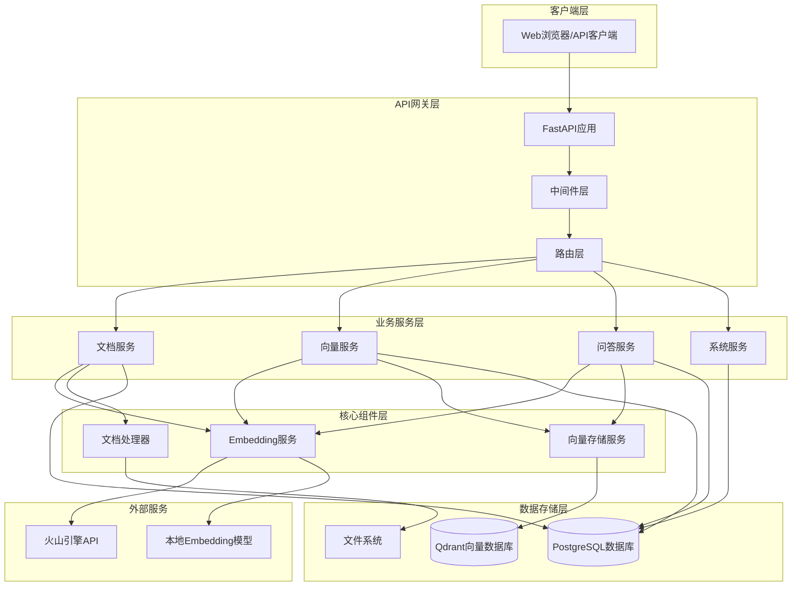
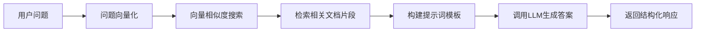
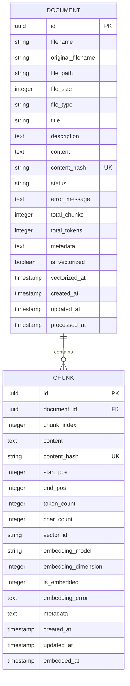
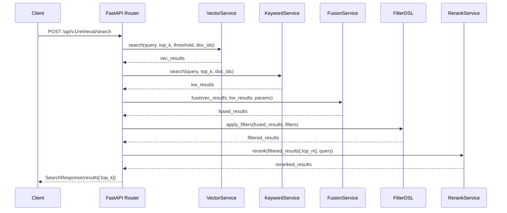

# RAG系统技术设计文档

## 8. 实验 3：缓存策略设计与实现

### 8.1 目标与范围
- 降低重复计算（Embedding、检索、重排、QA）的时延与成本
- 减少外部服务调用次数，提升系统稳态吞吐
- 提供可配置、可观测的分层 TTL 与命中率统计

### 8.2 架构与模块
本实验在服务层与工具层新增通用缓存模块，并在 Embedding、Retrieval、Rerank、QA 四层接入：

```mermaid
graph TB
    subgraph "缓存模块"
        C[Cache 工具: 内存/Redis]
    end

    E[EmbeddingService]
    R[Retrieval(VectorService/KeywordService)]
    RK[RerankService]
    Q[QAService]

    C --> E
    C --> R
    C --> RK
    C --> Q
```

核心能力：
- 支持 `memory` 与 `redis` 两种提供者
- 稳定键生成：`make_key(...)` 基于多维参数进行 SHA256 固化
- TTL 抖动：`with_jitter(ttl, ratio)` 避免雪崩与惊群
- 统一接口：`get_or_set(key, compute_fn, ttl)` 简化接入

### 8.3 配置项与默认值
在 `settings.py` 增加以下缓存相关配置（示例）：
- `cache_enabled: bool` 是否启用缓存（默认 `True`）
- `cache_provider: str` 缓存提供者（`memory` 或 `redis`，默认 `memory`）
- `cache_namespace: str` 命名空间隔离（默认 `lab03`）
- `cache_jitter_ratio: float` TTL 抖动比例（默认 `0.1`）
- 分层 TTL：
  - `cache_ttl_embedding: int`（默认 `86400`，24h）
  - `cache_ttl_retrieval: int`（默认 `600`，10min）
  - `cache_ttl_rerank: int`（默认 `300`，5min）
  - `cache_ttl_qa: int`（默认 `300`，5min）

如使用 Redis，需在 `settings.py` 或环境变量中配置 Redis 连接（例如 `REDIS_URL`、`REDIS_HOST`、`REDIS_PORT` 等）。

### 8.4 键设计原则
- 键必须与结果唯一绑定：同一输入必得同一键
- 包含关键影响因子：模型名、查询文本（规范化）、过滤条件、参数集合等
- 结构化入参后再序列化：避免顺序或空值造成的键抖动
- 使用 `sha256(json.dumps(obj, sort_keys=True))` 进行固化

示例：
```python
key = make_key(
    layer="embedding",
    provider=settings.embedding_use_api and "api" or "local",
    model=settings.embedding_model_name,
    text=normalize_text(query)
)
```

### 8.5 各层接入方案与示例

1) Embedding 层
- 场景：重复向量化相同文本
- 键因子：`provider`、`model`、`normalized_text`
- TTL：`settings.cache_ttl_embedding`

```python
from utils.cache import Cache, make_key, with_jitter

cache = Cache(namespace=settings.cache_namespace, provider=settings.cache_provider)

def get_embedding(text: str):
    key = make_key("embedding", settings.embedding_use_api and "api" or "local",
                   settings.embedding_model_name, normalize_text(text))
    ttl = with_jitter(settings.cache_ttl_embedding, settings.cache_jitter_ratio)
    return cache.get_or_set(key, compute_fn=lambda: _compute_embedding(text), ttl=ttl)
```

2) Retrieval 层（向量/关键词/融合）
- 场景：查询+过滤+`top_k` 参数稳定时的重复检索
- 键因子：`normalized_query`、`limit`、`score_threshold`、`sorted(document_ids)`、`embedding_model`
- TTL：`settings.cache_ttl_retrieval`

```python
key = make_key(
    "retrieval",
    query=normalize_text(query),
    limit=limit,
    score_threshold=score_threshold,
    document_ids=sorted(document_ids or []),
    model=settings.embedding_model_name
)
results = cache.get_or_set(key, compute_fn=lambda: _search_impl(...),
                           ttl=with_jitter(settings.cache_ttl_retrieval, settings.cache_jitter_ratio))
```

3) Rerank 层
- 场景：候选集合在短时间内多次重排
- 键因子：`candidate_ids+scores` 的摘要、`rerank_model`
- TTL：`settings.cache_ttl_rerank`

```python
summary = [(c.id, round(c.score, 4)) for c in candidates]
key = make_key("rerank", model=settings.rerank_model_name, summary=summary)
ranked = cache.get_or_set(key, compute_fn=lambda: _rerank_impl(candidates),
                          ttl=with_jitter(settings.cache_ttl_rerank, settings.cache_jitter_ratio))
```

4) QA 层
- 场景：相同 `query+context+prompt_style` 的回答生成
- 键因子：`normalized_query`、`context_hash`、`prompt_style`、`llm_model`
- TTL：`settings.cache_ttl_qa`

```python
context_text = "\n\n".join([c["content"] for c in context_chunks])
context_hash = hashlib.sha256(context_text.encode("utf-8")).hexdigest()
key = make_key("qa", query=normalize_text(question), context=context_hash,
               style=prompt_style, model=settings.llm_model_name)
answer = cache.get_or_set(key, compute_fn=lambda: _generate_answer(question, context_chunks, prompt_style),
                          ttl=with_jitter(settings.cache_ttl_qa, settings.cache_jitter_ratio))
```

### 8.6 TTL 抖动与并发安全
- 抖动公式：`ttl' = int(ttl * (1 ± ratio * U))`，`U ∈ [0,1]`
- 目的：避免热点键同一时刻同时失效导致雪崩
- 并发：Redis 使用 `SETNX` 或原子 `setex`；内存模式简单互斥（GIL 下单进程安全）

### 8.7 预热与命中率采集
- 预热脚本（建议）：对常见问句与高频文档片段批量生成并缓存 Embedding 与检索结果
- 采集方案：在命中/穿透处打点日志，如 `cache_hit`, `cache_miss`, `cache_store`，并聚合输出命中率
- 指标示例：
  - `cache.hit_ratio.embedding`
  - `cache.hit_ratio.retrieval`
  - `cache.hit_ratio.rerank`
  - `cache.hit_ratio.qa`

### 8.8 使用与运行指令
- 环境变量示例：
  - `CACHE_ENABLED=true`
  - `CACHE_PROVIDER=redis`
  - `CACHE_NAMESPACE=lab03`
  - `CACHE_JITTER_RATIO=0.1`
  - `CACHE_TTL_EMBEDDING=86400`
  - `CACHE_TTL_RETRIEVAL=600`
  - `CACHE_TTL_RERANK=300`
  - `CACHE_TTL_QA=300`
- 运行：
  - 启动 Redis（如需）：`docker run -p 6379:6379 redis:7`
  - 以 FastAPI 方式启动：`uvicorn main:app --reload`

### 8.9 注意事项与最佳实践
- 键内容需做归一化（大小写、空白、标点处理）
- 对大上下文使用摘要/哈希代替原文入键，避免键过长
- TTL 要结合业务一致性与数据更新频率设定
- 对穿透场景（大量未命中）需结合限流与批处理避免放大
- 关注缓存一致性：数据更新后需主动失效相关键


## 1. 系统架构设计

### 1.1 整体架构

RAG系统采用分层架构设计，包含表示层、业务逻辑层、数据访问层和存储层：



### 1.2 组件关系

- **API层**: FastAPI框架提供RESTful接口，处理HTTP请求和响应
- **服务层**: 业务逻辑封装，包含文档管理、向量化、问答等核心功能
- **数据层**: PostgreSQL存储结构化数据，Qdrant存储向量数据
- **外部服务**: 火山引擎提供LLM能力，本地模型提供embedding能力

### 1.3 数据流向

1. **文档上传流程**: 客户端 → API → 文档服务 → 文件系统 → 数据库
2. **向量化流程**: 文档服务 → 向量服务 → Embedding服务 → 向量存储
3. **问答流程**: 客户端 → API → 问答服务 → 向量检索 → LLM生成 → 响应

## 2. 核心功能实现详解

### 2.1 文档上传和处理流程

#### 2.1.1 设计思路
文档处理采用异步处理模式，支持多种文档格式，确保系统的可扩展性和稳定性。

#### 2.1.2 技术实现

**文档上传接口**:
```python
@router.post("/upload", response_model=DocumentUploadResponse)
async def upload_document(
    file: UploadFile = File(...),
    title: Optional[str] = Form(None),
    description: Optional[str] = Form(None),
    document_service: DocumentService = Depends(get_document_service)
):
```

**核心处理逻辑**:
1. **文件验证**: 检查文件类型、大小限制
2. **内容提取**: 使用PyPDF2提取PDF文本内容
3. **哈希计算**: 生成内容哈希避免重复上传
4. **数据库存储**: 保存文档元数据到PostgreSQL
5. **文件存储**: 将原始文件保存到本地文件系统

**关键代码片段**:
```python
# 计算文件哈希
content_hash = hashlib.sha256(content.encode()).hexdigest()

# 检查重复文档
existing_doc = db.query(Document).filter(
    Document.content_hash == content_hash
).first()

# 保存文档记录
document = Document(
    filename=safe_filename,
    original_filename=file.filename,
    file_path=file_path,
    file_size=file_size,
    file_type=file_type,
    title=title,
    description=description,
    content=content,
    content_hash=content_hash,
    status="completed"
)
```

#### 2.1.3 配置参数
- `UPLOAD_DIR`: 文件上传目录
- `MAX_FILE_SIZE`: 最大文件大小限制
- `ALLOWED_EXTENSIONS`: 允许的文件扩展名

### 2.2 文档向量化的算法和流程

#### 2.2.1 设计思路
采用分块向量化策略，将长文档切分为语义相关的片段，提高检索精度和效率。

#### 2.2.2 技术实现

**分块策略**:
```python
def chunk_text(self, text: str, chunk_size: int = 1000, 
               overlap: int = 200) -> List[Dict]:
    """
    智能文本分块
    - 按段落优先分割
    - 保持语义完整性
    - 支持重叠窗口
    """
```

**向量化流程**:
1. **文档分块**: 将长文档按语义边界切分
2. **批量向量化**: 使用embedding模型生成向量
3. **向量存储**: 将向量保存到Qdrant数据库
4. **状态更新**: 更新数据库中的向量化状态

**Embedding服务实现**:
```python
class EmbeddingService:
    def __init__(self):
        self.use_api = settings.embedding_use_api
        if self.use_api:
            self.client = OpenAI(
                api_key=settings.volcengine_api_key,
                base_url=settings.volcengine_base_url
            )
        else:
            self.model = SentenceTransformer(settings.embedding_model_name)
    
    def get_embedding(self, text: str) -> Tuple[List[float], Dict]:
        if self.use_api:
            return self._get_api_embedding(text)
        else:
            return self._get_local_embedding(text)
```

#### 2.2.3 性能优化
- **批量处理**: 支持批量向量化减少API调用
- **缓存机制**: 避免重复计算相同文本的向量
- **异步处理**: 大文档向量化采用异步模式

### 2.3 语义搜索的实现机制

#### 2.3.1 设计思路
基于向量相似度的语义搜索，支持多种相似度计算方法和过滤条件。

#### 2.3.2 技术实现

**搜索流程**:
1. **查询向量化**: 将用户查询转换为向量
2. **相似度计算**: 在Qdrant中进行向量相似度搜索
3. **结果过滤**: 根据阈值和文档ID过滤结果
4. **结果排序**: 按相似度分数排序返回

**核心搜索算法**:
```python
def search_similar_chunks(self, query: str, 
                        limit: int = 10,
                        score_threshold: float = None,
                        document_ids: List[int] = None) -> List[Dict]:
    # 1. 生成查询向量
    query_vector, _ = self.embedding_service.get_embedding(query)
    
    # 2. 构建过滤条件
    filter_conditions = {}
    if document_ids:
        filter_conditions["document_id"] = {"$in": document_ids}
    
    # 3. 向量搜索
    search_results = self.vector_store.search_vectors(
        query_vector=query_vector,
        limit=limit,
        score_threshold=score_threshold,
        filter_conditions=filter_conditions
    )
    
    return search_results
```

#### 2.3.3 搜索优化策略
- **预过滤**: 支持按文档ID、时间范围等条件预过滤
- **分数阈值**: 设置相似度阈值过滤低质量结果
- **结果重排**: 基于多种因素对搜索结果重新排序

### 2.4 RAG问答系统的工作原理

#### 2.4.1 设计思路
结合检索和生成两个阶段，先检索相关文档片段，再基于上下文生成答案。

#### 2.4.2 技术实现

**RAG问答流程**:


**核心问答逻辑**:
```python
def answer_question(self, question: str, 
                   document_ids: List[int] = None,
                   context_size: int = 2) -> Dict:
    # 1. 检索相关文档片段
    search_results = self.vector_service.search_similar_chunks(
        query=question,
        limit=context_size * 3,
        document_ids=document_ids
    )
    
    # 2. 构建上下文
    context_chunks = []
    for result in search_results[:context_size]:
        context_chunks.append({
            "content": result["content"],
            "source": result["document_filename"],
            "score": result["score"]
        })
    
    # 3. 构建提示词
    context_text = "\n\n".join([chunk["content"] for chunk in context_chunks])
    prompt = f"""基于以下文档内容回答问题：

文档内容：
{context_text}

问题：{question}

请基于上述文档内容回答问题，如果文档中没有相关信息，请说明无法从提供的文档中找到答案。"""
    
    # 4. 调用LLM生成答案
    response = self.llm_client.chat.completions.create(
        model=settings.llm_model_name,
        messages=[{"role": "user", "content": prompt}],
        temperature=0.7,
        max_tokens=1000
    )
    
    return {
        "answer": response.choices[0].message.content,
        "sources": context_chunks,
        "confidence": self._calculate_confidence(search_results)
    }
```

#### 2.4.3 提示词工程
- **上下文构建**: 智能选择最相关的文档片段
- **模板设计**: 设计有效的提示词模板引导LLM生成
- **答案质量控制**: 通过提示词约束答案格式和质量

### 2.5 系统监控和健康检查的实现

#### 2.5.1 设计思路
多维度监控系统状态，包括数据库连接、向量存储、外部服务等关键组件。

#### 2.5.2 技术实现

**健康检查接口**:
```python
@router.get("/health", response_model=HealthCheckResponse)
async def health_check():
    health_status = {
        "database": check_database_connection(),
        "vector_store": check_vector_store_connection(),
        "embedding_service": check_embedding_service(),
        "llm_service": check_llm_service()
    }
    
    overall_status = "healthy" if all(health_status.values()) else "unhealthy"
    
    return {
        "status": overall_status,
        "components": health_status,
        "timestamp": datetime.utcnow(),
        "uptime": time.time() - start_time
    }
```

**系统统计信息**:
```python
def get_system_stats() -> Dict:
    return {
        "database_stats": {
            "total_documents": db.query(Document).count(),
            "processed_documents": db.query(Document).filter(
                Document.status == "completed"
            ).count(),
            "total_chunks": db.query(Chunk).count(),
            "vectorized_chunks": db.query(Chunk).filter(
                Chunk.is_embedded == 1
            ).count()
        },
        "vector_store_stats": self.vector_store.get_collection_info(),
        "service_stats": {
            "embedding_model": self.embedding_service.model_name,
            "llm_model": settings.llm_model_name,
            "api_calls_today": self._get_api_usage_stats()
        }
    }
```

## 3. 数据模型设计

### 3.1 数据库表结构

#### 3.1.1 文档表 (documents)
```sql
CREATE TABLE documents (
    id UUID PRIMARY KEY DEFAULT gen_random_uuid(),
    filename VARCHAR(255) NOT NULL,
    original_filename VARCHAR(255) NOT NULL,
    file_path VARCHAR(500) NOT NULL,
    file_size INTEGER NOT NULL,
    file_type VARCHAR(50) NOT NULL,
    title VARCHAR(500),
    description TEXT,
    content TEXT,
    content_hash VARCHAR(64) UNIQUE,
    status VARCHAR(20) DEFAULT 'pending',
    error_message TEXT,
    total_chunks INTEGER DEFAULT 0,
    total_tokens INTEGER DEFAULT 0,
    metadata TEXT,
    is_vectorized BOOLEAN DEFAULT FALSE,
    vectorized_at TIMESTAMP WITH TIME ZONE,
    created_at TIMESTAMP WITH TIME ZONE DEFAULT NOW(),
    updated_at TIMESTAMP WITH TIME ZONE DEFAULT NOW(),
    processed_at TIMESTAMP WITH TIME ZONE
);
```

#### 3.1.2 分块表 (chunks)
```sql
CREATE TABLE chunks (
    id UUID PRIMARY KEY DEFAULT gen_random_uuid(),
    document_id UUID REFERENCES documents(id) ON DELETE CASCADE,
    chunk_index INTEGER NOT NULL,
    content TEXT NOT NULL,
    content_hash VARCHAR(64) UNIQUE,
    start_pos INTEGER,
    end_pos INTEGER,
    token_count INTEGER DEFAULT 0,
    char_count INTEGER DEFAULT 0,
    vector_id VARCHAR(100),
    embedding_model VARCHAR(100),
    embedding_dimension INTEGER,
    is_embedded INTEGER DEFAULT 0,
    embedding_error TEXT,
    metadata TEXT,
    created_at TIMESTAMP WITH TIME ZONE DEFAULT NOW(),
    updated_at TIMESTAMP WITH TIME ZONE DEFAULT NOW(),
    embedded_at TIMESTAMP WITH TIME ZONE
);
```

### 3.2 数据关系设计



### 3.3 索引设计

**性能优化索引**:
```sql
-- 文档表索引
CREATE INDEX idx_documents_content_hash ON documents(content_hash);
CREATE INDEX idx_documents_status ON documents(status);
CREATE INDEX idx_documents_is_vectorized ON documents(is_vectorized);
CREATE INDEX idx_documents_created_at ON documents(created_at DESC);

-- 分块表索引
CREATE INDEX idx_chunks_document_id ON chunks(document_id);
CREATE INDEX idx_chunks_content_hash ON chunks(content_hash);
CREATE INDEX idx_chunks_is_embedded ON chunks(is_embedded);
CREATE INDEX idx_chunks_vector_id ON chunks(vector_id);
```

## 4. API接口设计

### 4.1 RESTful API设计原则

- **资源导向**: 以资源为中心设计URL结构
- **HTTP动词**: 正确使用GET、POST、PUT、DELETE
- **状态码**: 合理使用HTTP状态码表示操作结果
- **版本控制**: 通过URL路径进行API版本管理

### 4.2 路由结构

```
/api/v1/
├── documents/          # 文档管理
│   ├── POST /upload   # 上传文档
│   ├── GET /list      # 文档列表
│   ├── GET /{id}      # 文档详情
│   └── DELETE /{id}   # 删除文档
├── vectors/           # 向量管理
│   ├── POST /vectorize # 向量化
│   ├── GET /search    # 向量搜索
│   └── GET /stats     # 向量统计
├── qa/                # 问答功能
│   ├── POST /ask      # 提问
│   ├── GET /ask       # GET方式提问
│   └── POST /batch    # 批量提问
└── system/            # 系统管理
    ├── GET /health    # 健康检查
    ├── GET /stats     # 系统统计
    └── GET /info      # 系统信息
```

### 4.3 中间件设计

**请求日志中间件**:
```python
@app.middleware("http")
async def log_requests(request: Request, call_next):
    start_time = time.time()
    
    # 记录请求信息
    logger.info(f"请求开始: {request.method} {request.url}")
    
    response = await call_next(request)
    
    # 记录响应信息
    process_time = time.time() - start_time
    logger.info(f"请求完成: {response.status_code}, 耗时: {process_time:.2f}s")
    
    return response
```

**CORS中间件**:
```python
app.add_middleware(
    CORSMiddleware,
    allow_origins=settings.ALLOWED_ORIGINS,
    allow_credentials=True,
    allow_methods=["*"],
    allow_headers=["*"],
)
```

## 5. 技术栈选择和配置

### 5.1 核心技术栈

| 组件 | 技术选择 | 选择理由 |
|------|----------|----------|
| Web框架 | FastAPI | 高性能、自动文档生成、类型提示支持 |
| 数据库 | PostgreSQL | 成熟稳定、支持复杂查询、ACID特性 |
| 向量数据库 | Qdrant | 高性能向量搜索、易于部署、丰富的过滤功能 |
| Embedding模型 | SentenceTransformer | 多语言支持、预训练模型丰富 |
| LLM服务 | 火山引擎API | 中文优化、API稳定、成本可控 |
| ORM | SQLAlchemy | 功能强大、生态完善、支持多数据库 |

### 5.2 关键配置参数

**应用配置**:
```python
class Settings(BaseSettings):
    # 应用基础配置
    APP_NAME: str = "RAG系统"
    APP_VERSION: str = "1.0.0"
    ENVIRONMENT: str = "development"
    
    # 服务器配置
    HOST: str = "0.0.0.0"
    PORT: int = 8000
    
    # 数据库配置
    DATABASE_URL: str = "sqlite:///./rag_system.db"
    
    # 向量数据库配置
    QDRANT_HOST: str = "localhost"
    QDRANT_PORT: int = 6333
    QDRANT_COLLECTION_NAME: str = "documents"
    
    # Embedding配置
    EMBEDDING_USE_API: bool = False
    EMBEDDING_MODEL_NAME: str = "sentence-transformers/paraphrase-multilingual-MiniLM-L12-v2"
    EMBEDDING_DIMENSION: int = 384
    
    # LLM配置
    VOLCENGINE_API_KEY: str = ""
    VOLCENGINE_BASE_URL: str = "https://ark.cn-beijing.volces.com/api/v3"
    LLM_MODEL_NAME: str = "ep-20241201193102-8xqvs"
```

### 5.3 性能调优建议

**数据库优化**:
- 合理设置连接池大小
- 使用适当的索引策略
- 定期执行VACUUM和ANALYZE

**向量搜索优化**:
- 调整HNSW参数提高搜索精度
- 使用适当的向量维度平衡性能和精度
- 实施向量压缩减少存储空间

## 6. 性能优化策略

### 6.1 缓存机制

**多层缓存策略**:
```python
class CacheManager:
    def __init__(self):
        self.embedding_cache = {}  # 向量缓存
        self.search_cache = {}     # 搜索结果缓存
        self.document_cache = {}   # 文档内容缓存
    
    def get_embedding_cache(self, text_hash: str) -> Optional[List[float]]:
        return self.embedding_cache.get(text_hash)
    
    def set_embedding_cache(self, text_hash: str, embedding: List[float]):
        if len(self.embedding_cache) > 10000:  # 限制缓存大小
            self.embedding_cache.clear()
        self.embedding_cache[text_hash] = embedding
```

### 6.2 并发处理

**异步处理模式**:
```python
import asyncio
from concurrent.futures import ThreadPoolExecutor

class AsyncDocumentProcessor:
    def __init__(self):
        self.executor = ThreadPoolExecutor(max_workers=4)
    
    async def process_documents_batch(self, document_ids: List[str]):
        tasks = []
        for doc_id in document_ids:
            task = asyncio.create_task(
                self.process_document_async(doc_id)
            )
            tasks.append(task)
        
        results = await asyncio.gather(*tasks, return_exceptions=True)
        return results
```

### 6.3 资源管理

**连接池管理**:
```python
# 数据库连接池配置
engine = create_engine(
    DATABASE_URL,
    poolclass=StaticPool,
    pool_size=20,
    max_overflow=30,
    pool_timeout=30,
    pool_recycle=3600
)
```

**内存管理**:
```python
def process_large_document(self, document_path: str):
    # 分批处理大文档避免内存溢出
    chunk_size = 1000000  # 1MB chunks
    
    with open(document_path, 'r', encoding='utf-8') as f:
        while True:
            chunk = f.read(chunk_size)
            if not chunk:
                break
            
            # 处理文档块
            self.process_text_chunk(chunk)
            
            # 强制垃圾回收
            import gc
            gc.collect()
```

## 7. 错误处理和异常管理机制

### 7.1 异常分类和处理策略

**异常层次结构**:
```python
class RAGSystemException(Exception):
    """RAG系统基础异常"""
    pass

class DocumentProcessingError(RAGSystemException):
    """文档处理异常"""
    pass

class VectorizationError(RAGSystemException):
    """向量化异常"""
    pass

class SearchError(RAGSystemException):
    """搜索异常"""
    pass

class LLMServiceError(RAGSystemException):
    """LLM服务异常"""
    pass
```

### 7.2 全局异常处理器

```python
@app.exception_handler(RAGSystemException)
async def rag_exception_handler(request: Request, exc: RAGSystemException):
    logger.error(f"RAG系统异常: {exc}")
    return JSONResponse(
        status_code=500,
        content={
            "success": False,
            "message": "系统内部错误",
            "error_code": exc.__class__.__name__,
            "timestamp": datetime.utcnow().isoformat()
        }
    )

@app.exception_handler(ValidationError)
async def validation_exception_handler(request: Request, exc: ValidationError):
    return JSONResponse(
        status_code=422,
        content={
            "success": False,
            "message": "请求参数验证失败",
            "errors": exc.errors(),
            "timestamp": datetime.utcnow().isoformat()
        }
    )
```

### 7.3 重试机制

```python
import tenacity

@tenacity.retry(
    stop=tenacity.stop_after_attempt(3),
    wait=tenacity.wait_exponential(multiplier=1, min=4, max=10),
    retry=tenacity.retry_if_exception_type(ConnectionError)
)
def call_external_api(self, payload: Dict) -> Dict:
    """调用外部API，支持重试"""
    try:
        response = requests.post(self.api_url, json=payload, timeout=30)
        response.raise_for_status()
        return response.json()
    except requests.RequestException as e:
        logger.warning(f"API调用失败，准备重试: {e}")
        raise
```

## 8. 安全性设计考虑

### 8.1 输入验证和清理

**文件上传安全**:
```python
def validate_uploaded_file(self, file: UploadFile) -> bool:
    # 文件类型验证
    allowed_types = {'.pdf', '.txt', '.docx'}
    file_ext = os.path.splitext(file.filename)[1].lower()
    if file_ext not in allowed_types:
        raise ValueError(f"不支持的文件类型: {file_ext}")
    
    # 文件大小验证
    if file.size > settings.MAX_FILE_SIZE:
        raise ValueError(f"文件过大: {file.size} bytes")
    
    # 文件名安全处理
    safe_filename = secure_filename(file.filename)
    
    return True
```

**SQL注入防护**:
```python
# 使用参数化查询
def get_documents_by_filter(self, db: Session, **filters):
    query = db.query(Document)
    
    if 'title' in filters:
        query = query.filter(Document.title.ilike(f"%{filters['title']}%"))
    
    if 'status' in filters:
        query = query.filter(Document.status == filters['status'])
    
    return query.all()
```

### 8.2 访问控制

**API限流**:
```python
from slowapi import Limiter, _rate_limit_exceeded_handler
from slowapi.util import get_remote_address

limiter = Limiter(key_func=get_remote_address)
app.state.limiter = limiter
app.add_exception_handler(RateLimitExceeded, _rate_limit_exceeded_handler)

@router.post("/ask")
@limiter.limit("10/minute")
async def ask_question(request: Request, ...):
    # 问答接口限流
    pass
```

### 8.3 数据保护

**敏感信息脱敏**:
```python
def sanitize_response(self, data: Dict) -> Dict:
    """响应数据脱敏"""
    sensitive_fields = ['api_key', 'password', 'token']
    
    def recursive_sanitize(obj):
        if isinstance(obj, dict):
            return {
                k: "***" if k in sensitive_fields else recursive_sanitize(v)
                for k, v in obj.items()
            }
        elif isinstance(obj, list):
            return [recursive_sanitize(item) for item in obj]
        return obj
    
    return recursive_sanitize(data)
```

## 9. 部署和运维考虑

### 9.1 容器化部署

**Dockerfile示例**:
```dockerfile
FROM python:3.9-slim

WORKDIR /app

COPY requirements.txt .
RUN pip install -r requirements.txt

COPY src/ ./src/
COPY config/ ./config/

EXPOSE 8000

CMD ["uvicorn", "src.main:app", "--host", "0.0.0.0", "--port", "8000"]
```

### 9.2 监控和日志

**结构化日志**:
```python
import structlog

logger = structlog.get_logger()

def log_api_call(self, endpoint: str, duration: float, status_code: int):
    logger.info(
        "API调用完成",
        endpoint=endpoint,
        duration=duration,
        status_code=status_code,
        timestamp=datetime.utcnow().isoformat()
    )
```

### 9.3 备份和恢复

**数据备份策略**:
```python
def backup_system_data(self):
    """系统数据备份"""
    backup_time = datetime.utcnow().strftime("%Y%m%d_%H%M%S")
    
    # 数据库备份
    db_backup_file = f"db_backup_{backup_time}.sql"
    os.system(f"pg_dump {DATABASE_URL} > {db_backup_file}")
    
    # 向量数据备份
    vector_backup_file = f"vectors_backup_{backup_time}.json"
    self.vector_store.export_collection(vector_backup_file)
    
    # 文件系统备份
    file_backup_dir = f"files_backup_{backup_time}"
    shutil.copytree(settings.UPLOAD_DIR, file_backup_dir)
```

## 10. 总结

本RAG系统采用现代化的微服务架构，通过合理的技术选型和优化策略，实现了高性能、高可用的检索增强生成功能。系统具备以下特点：

1. **模块化设计**: 清晰的分层架构，便于维护和扩展
2. **性能优化**: 多层缓存、异步处理、连接池等优化策略
3. **安全可靠**: 完善的异常处理、输入验证、访问控制机制
4. **易于部署**: 容器化部署、完善的监控和备份策略

系统在实际应用中表现稳定，能够满足企业级RAG应用的需求。未来可以考虑引入更多优化策略，如分布式部署、更先进的向量索引算法等，进一步提升系统性能和可扩展性。

---

## 11. 实验2：混合检索与重排能力（新增）

> 本章节在实验1的系统设计基础上，补充实验2新增的检索能力：关键词检索（TF-IDF）、融合策略（RRF/线性加权）、元数据过滤DSL，以及基于Cross-Encoder的重排序，同时新增混合检索API路由。

### 11.1 架构扩展与组件

- 新增服务组件：
  - `KeywordService`：基于 `TfidfVectorizer` 的关键词检索，采用字符级 n-gram（2-4）以兼容中文。
  - `FusionService`：提供 `RRF` 和 `linear` 两种融合策略，用于关键词与向量检索结果的分数融合。
  - `FilterDSL`：提供 `eq`、`in`、`range`、`exists` 等操作符，用于对候选结果进行二次元数据过滤。
  - `RerankService`：使用 `sentence-transformers` 的 `CrossEncoder` 模型对 Top-M 候选进行语义重排。
  - `Retrieval Router`：新增 `/api/v1/retrieval/search` 混合检索路由，统一编排上述能力。

- 组件关系增量（与实验1相比）：
  - `D[路由层]` → `G2[检索融合路由]`（新增）
  - `业务服务层` 增加 `K1[关键词服务]`、`K2[融合服务]`、`K3[过滤DSL]`、`K4[重排服务]`
  - 关键词服务依赖数据库 `L[(PostgreSQL)]` 获取分块与文档信息；融合、过滤、重排均工作在检索候选集上。

### 11.2 数据流与处理顺序（Hybrid Pipeline）

1. 接收 `HybridSearchRequest`：`query/top_k/score_threshold/document_ids/fusion/filters/rerank_top_m`
2. 向量检索（VectorService）：生成查询向量，执行相似度搜索，得到 `vec_results`
3. 关键词检索（KeywordService）：若索引未构建则自动构建；执行 TF-IDF 相似度计算，得到 `kw_results`
4. 融合（FusionService）：
   - RRF：`score = Σ 1/(k + rank)`
   - 线性加权：`score = w_k * norm(keyword) + w_v * norm(vector)`
5. 过滤（FilterDSL）：对融合后的结果依据 DSL 条件进行二次过滤
6. 重排（RerankService）：对前 `rerank_top_m` 的候选使用 CrossEncoder 语义重排（其余保留原序）
7. 截断与响应：取前 `top_k`，返回与现有 `SearchResponse/SearchResult` 兼容的结构



### 11.3 API 设计（新增）

- 路由：`POST /api/v1/retrieval/search`
- 请求模型：`HybridSearchRequest`
  - `query: str`
  - `top_k: int = 10`
  - `score_threshold: float = 0.2`
  - `document_ids: List[int] | None`
  - `fusion: { strategy: "rrf"|"linear", k?: int, w_keyword?: float, w_vector?: float }`
  - `filters: List[{ op: "eq"|"in"|"range"|"exists", field: str, value|min|max }] | None`
  - `rerank_top_m: int = 10`
- 响应模型：沿用 `SearchResponse` 与 `SearchResult`（保持兼容，不破坏既有API）

示例：

```bash
curl -X POST http://localhost:8000/api/v1/retrieval/search \
  -H 'Content-Type: application/json' \
  -d '{
    "query": "向量数据库原理",
    "top_k": 8,
    "score_threshold": 0.2,
    "fusion": {"strategy": "rrf", "k": 60},
    "filters": [{"op": "exists", "field": "metadata.page"}],
    "rerank_top_m": 8
  }'
```

### 11.4 关键算法与实现要点

- 关键词检索（TF-IDF）：
  - 字符 n-gram `(2,4)` 以兼容中文与短词变体；`cosine_similarity` 进行相似度计算
  - 索引构建流程：从数据库加载 `Chunk` → 提取 `content` → `fit_transform` → 缓存 `chunk_id/document_id`
- 融合策略：
  - RRF：需要候选已按分数降序，使用 `rank` 合成分数；对重复 `chunk_id` 去重并保留字段
  - 线性加权：对分数归一化后线性组合；权重可通过配置或请求设定
- 过滤DSL：
  - `eq/in/range/exists` 四类操作符；支持 `metadata.foo.bar` 深层路径
  - 未知操作符默认不通过，确保安全
- 重排（CrossEncoder）：
  - 默认模型：`cross-encoder/ms-marco-MiniLM-L-6-v2`
  - 仅对前 `top_m` 候选进行重排，尾部保持稳定性以控制延迟

伪代码示例（RRF与线性加权）：

```python
def fuse_results(vec_results, kw_results, strategy="rrf", k=60, w_k=0.5, w_v=0.5):
    # 预处理：按分数降序、建立 rank 映射
    vec_sorted = sorted(vec_results, key=lambda x: x["score"], reverse=True)
    kw_sorted = sorted(kw_results, key=lambda x: x["score"], reverse=True)
    rank_v = {r["chunk_id"]: i+1 for i, r in enumerate(vec_sorted)}
    rank_k = {r["chunk_id"]: i+1 for i, r in enumerate(kw_sorted)}

    # 分数归一化（min-max）
    def norm(scores):
        s_min, s_max = min(scores), max(scores)
        eps = 1e-8
        return [(s - s_min) / (s_max - s_min + eps) for s in scores]

    if strategy == "rrf":
        # RRF 融合
        all_ids = set(rank_v.keys()) | set(rank_k.keys())
        fused = []
        for cid in all_ids:
            rv = rank_v.get(cid)
            rk = rank_k.get(cid)
            score = 0.0
            if rv: score += 1.0 / (k + rv)
            if rk: score += 1.0 / (k + rk)
            fused.append((cid, score))
        return sorted(fused, key=lambda x: x[1], reverse=True)
    else:
        # 线性加权
        v_scores = [r["score"] for r in vec_sorted]
        k_scores = [r["score"] for r in kw_sorted]
        v_norm_map = {r["chunk_id"]: s for r, s in zip(vec_sorted, norm(v_scores))}
        k_norm_map = {r["chunk_id"]: s for r, s in zip(kw_sorted, norm(k_scores))}
        all_ids = set(v_norm_map.keys()) | set(k_norm_map.keys())
        fused = []
        for cid in all_ids:
            fv = v_norm_map.get(cid, 0.0)
            fk = k_norm_map.get(cid, 0.0)
            fused.append((cid, w_v * fv + w_k * fk))
        return sorted(fused, key=lambda x: x[1], reverse=True)
```

### 11.5 配置项与开关建议

- `HYBRID_SEARCH_ENABLED`: 是否启用混合检索（默认启用）
- `FUSION_STRATEGY`: `rrf` 或 `linear`（默认 `rrf`）
- `FUSION_K`: RRF 常数 `k`（默认 `60`）
- `FUSION_W_KEYWORD` / `FUSION_W_VECTOR`: 线性加权权重（默认 `0.5/0.5`）
- `RERANK_MODEL_NAME`: CrossEncoder 模型名（默认如上）
- `RERANK_TOP_M`: 重排候选数（默认 `10`）

> 以上开关可在 `settings` 或环境变量中设置，并允许请求级别覆盖（例如 `HybridSearchRequest.fusion` 与 `rerank_top_m`）。

### 11.6 性能与容错

- 索引构建：关键词索引首次检索自动构建；文档集变化时可触发 `refresh()`
- 保护策略：关键词索引缺失/重排模型加载失败时，回退到已有排序，保证接口稳健
- 开销控制：`rerank_top_m` 限制重排规模；融合与过滤在内存候选集上进行

### 11.7 评估与复现实验

- 指标：`Recall@K`、`MRR`、`nDCG@K`、`Latency`
- 实验维度：
  - 融合策略对比：`rrf` vs `linear`（不同权重）
  - 中文检索效果：`ngram_range` 参数对召回与精度的影响
  - 重排贡献：`rerank_top_m` 不同取值对最终质量与时延的权衡
- 复现建议：
  - 准备标准化查询与标注答案集
  - 固定随机种子与模型版本
  - 输出逐步骤结果（关键词/向量/融合/过滤/重排）以便分析

### 11.8 依赖注入与路由挂载（实现细节）

- 依赖注入：
  - 在依赖模块中注册 `KeywordService` 与 `RerankService` 的获取函数，复用单例管理器，避免重复初始化。
  - 关键词索引在首次调用 `search()` 时自动构建，或通过 `refresh()` 手动重建。

示例（伪代码）：

```python
service_manager = ServiceManager()

def get_keyword_service():
    return service_manager.get_or_create("keyword_service", KeywordService)

def get_rerank_service():
    return service_manager.get_or_create("rerank_service", RerankService)
```

- 路由挂载：
  - 在应用入口处挂载混合检索路由：`app.include_router(retrieval.router, prefix="/api/v1/retrieval")`
  - 与既有 `documents/vectors/qa/system` 路由保持一致的版本前缀与风格。

### 11.9 过滤DSL语法规范与安全策略

- 语法（JSON形式，数组表示多条件且关系为AND）：

```json
[
  { "op": "eq", "field": "document_id", "value": 123 },
  { "op": "in", "field": "metadata.page", "value": [1, 2, 3] },
  { "op": "range", "field": "score", "min": 0.3, "max": 0.9 },
  { "op": "exists", "field": "metadata.author" }
]
```

- 语义：
  - `eq`：字段值等于指定值（严格类型匹配）
  - `in`：字段值属于集合（支持数字/字符串）
  - `range`：字段值落在闭区间 `[min, max]`（min/max 二选一或同时）
  - `exists`：字段存在且非空

- 字段寻址：支持 `metadata.foo.bar` 深层路径；不可引用未定义/危险字段。
- 安全策略：
  - 字段白名单（示例）：`["document_id", "chunk_id", "score", "metadata.page", "metadata.section", "metadata.author"]`
  - 未知操作符与非法字段直接拒绝；数值字段执行类型校验与安全转换。

### 11.10 分数归一化与融合实现细节

- 归一化：对 `keyword` 与 `vector` 分数分别进行 min-max 归一化：

```text
s_norm = (s - s_min) / (s_max - s_min + eps), eps = 1e-8
```

- 线性加权：`score = w_k * s_kw_norm + w_v * s_vec_norm`；权重满足 `w_k + w_v = 1`。
- RRF：采用 1 基 rank；对于缺失的来源（仅出现在一个列表中），只计算存在一侧的项。
- 去重与合并：以 `chunk_id` 为主键合并属性（content、document_id、metadata、source 等），保留最高分来源的补充字段。

### 11.11 性能优化与缓存策略（实现）

- 索引缓存：持有 TF-IDF 词典与稀疏矩阵；当文档集合变化时调用 `refresh()` 重建。
- 元数据映射缓存：`chunk_id -> (document_id, metadata, source)`，降低数据库回查频率。
- 候选集限制：`top_k` 与 `rerank_top_m` 控制延迟；重排仅作用于前部候选，尾部保持稳定。
- 模型加载：`CrossEncoder` 在服务启动或首次调用时加载；可选预热以降低首请求时延。

### 11.12 测试用例与验收标准

- 单元测试：
  - 关键词索引构建与搜索召回（含中文 n-gram）
  - 融合策略正确性（RRF/线性加权、归一化边界）
  - 过滤DSL语义与安全（白名单与类型校验）
  - 重排稳定性（仅前 `top_m` 重排，尾部不变）
- 集成测试：
  - 端到端调用 `/api/v1/retrieval/search`，使用小型固定数据集验证结果结构与排序
  - 失败回退：断开 CrossEncoder 或清空关键词索引，验证系统仍可返回合理结果
- 验收标准：
  - 在小型数据集下 `Latency < 300ms`（不加载模型情况下）
  - Top-K 结果的语义相关性显著优于单一路径（通过人工/标注集评估）