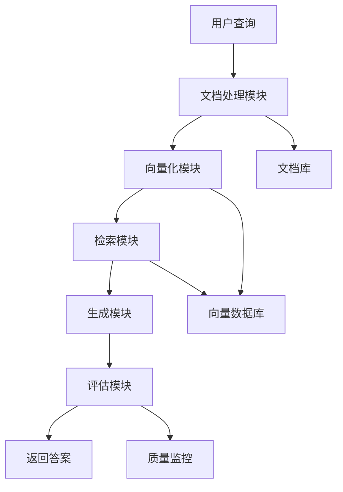

# RAG架构演示示例

## 传统AI vs RAG对比示例

### 场景：查询公司年假政策

#### 传统AI模式
```
用户问题: "我们公司的年假政策是什么？"

AI回答: "一般公司的年假政策是工作满一年后享有5-10天年假，
具体天数根据工龄递增。但我无法确定您公司的具体政策，
建议您查阅员工手册或咨询HR部门。"

问题: 
❌ 回答模糊，无法提供具体信息
❌ 无法访问公司内部政策文档
❌ 用户仍需要额外查找信息
```

#### RAG增强模式
```
用户问题: "我们公司的年假政策是什么？"

检索阶段:
- 从HR文档库检索到相关政策条款
- 找到《员工手册-第5章-休假制度》相关内容

增强阶段:
- 将检索到的政策条款整合到提示词中
- 上下文: "根据公司员工手册第5章规定..."

生成阶段:
AI回答: "根据公司员工手册第5章休假制度规定：
• 工作满1年：享有5天年假
• 工作满3年：享有10天年假  
• 工作满5年：享有15天年假
• 工作满10年：享有20天年假
年假需提前1周申请，当年未使用的年假可结转至次年上半年。

参考文档：《员工手册-第5章-休假制度》第5.2条"

优势:
✅ 提供准确的公司政策信息
✅ 基于真实文档，避免编造内容
✅ 提供信息来源，便于验证
✅ 回答完整具体，用户无需额外查找
```

## RAG三阶段详细示例

### 1. 检索阶段（Retrieval）

**输入**: 用户查询 "Python FastAPI如何实现异步处理？"

**处理过程**:
```python
# 伪代码示例
query_vector = embedding_model.encode("Python FastAPI异步处理")
similar_docs = vector_db.search(
    query_vector, 
    top_k=5,
    threshold=0.7
)
```

**输出**: 检索到的相关文档片段
```
文档1: "FastAPI基于Starlette框架，原生支持async/await语法..."
文档2: "使用async def定义异步路由函数，可以处理并发请求..."
文档3: "异步处理适用于I/O密集型操作，如数据库查询、API调用..."
```

### 2. 增强阶段（Augmentation）

**输入**: 用户查询 + 检索到的文档片段

**处理过程**:
```python
# 构建增强提示词
prompt = f"""
基于以下文档内容回答用户问题：

文档内容：
{retrieved_docs}

用户问题：{user_query}

请基于文档内容提供准确、详细的回答。
"""
```

**输出**: 包含上下文的完整提示词

### 3. 生成阶段（Generation）

**输入**: 增强后的提示词

**处理过程**: LLM基于提示词生成回答

**输出**: 最终答案
```
FastAPI实现异步处理的方法：

1. 使用async/await语法
   async def get_data():
       result = await database.fetch_data()
       return result

2. 异步路由定义
   @app.get("/api/data")
   async def api_endpoint():
       return await process_data()

3. 适用场景
   - 数据库查询
   - 外部API调用  
   - 文件I/O操作
   - 网络请求

参考文档：《FastAPI异步编程指南》
```

## RAG系统模块协作示例

### 完整流程演示



### 各模块输入输出示例

**文档处理模块**:
```
输入: PDF文档《企业级RAG系统设计指南》
处理: 解析PDF → 提取文本 → 清洗格式 → 分块处理
输出: 
- 块1: "RAG系统由检索、增强、生成三个核心模块组成..."
- 块2: "向量数据库是RAG系统的关键组件，负责存储..."
- 块3: "企业级部署需要考虑性能、安全、可扩展性..."
```

**向量化模块**:
```
输入: 文本块 "RAG系统由检索、增强、生成三个核心模块组成"
处理: 文本编码 → 向量表示
输出: [0.1, -0.3, 0.8, ..., 0.2] (768维向量)
```

**检索模块**:
```
输入: 查询向量 + 相似度阈值
处理: 向量相似度计算 → 排序 → 筛选
输出: Top-K相关文档片段及相似度分数
```

**生成模块**:
```
输入: 用户查询 + 检索结果 + 系统提示
处理: 提示词构建 → LLM生成 → 后处理
输出: 结构化答案 + 来源引用
```

**评估模块**:
```
输入: 生成的答案 + 用户反馈
处理: 质量评估 → 性能监控 → 优化建议
输出: 质量分数 + 改进建议
```

## 企业应用场景示例

### 1. 客服系统
```
场景: 用户咨询产品功能
查询: "你们的VIP会员有什么特权？"
检索: 从产品文档中找到VIP权益说明
回答: "VIP会员享有以下特权：1.免费配送 2.专属客服 3.优先退换货..."
来源: 《产品服务手册-VIP会员权益》
```

### 2. 技术文档查询
```
场景: 开发者查询API使用方法
查询: "如何调用用户认证接口？"
检索: 从API文档中找到认证相关内容
回答: "用户认证接口调用方法：POST /api/auth/login..."
来源: 《API开发文档-认证模块》
```

### 3. 企业知识管理
```
场景: 员工查询内部流程
查询: "新员工入职需要准备什么材料？"
检索: 从HR制度文档中找到入职流程
回答: "新员工入职需准备：1.身份证复印件 2.学历证明..."
来源: 《人力资源管理制度-入职流程》
```

## 常见问题和解决方案

### Q1: RAG和搜索引擎有什么区别？
**A**: 搜索引擎返回文档列表让用户自己阅读，RAG是将搜索结果作为上下文让AI生成针对性回答。

### Q2: RAG系统如何保证答案准确性？
**A**: 通过文档来源追溯、多文档交叉验证、置信度评估等机制保证准确性。

### Q3: 企业部署RAG需要考虑哪些因素？
**A**: 数据安全、性能要求、成本控制、可扩展性、维护便利性等。