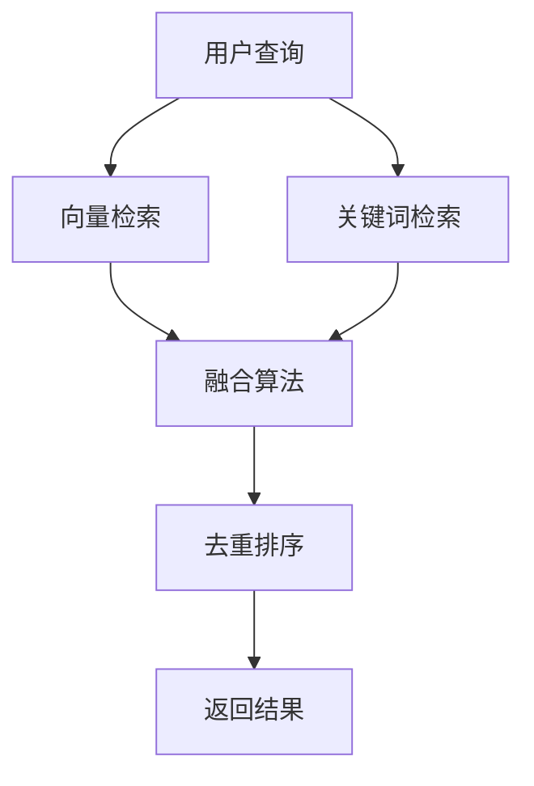

# 第八节课：混合检索融合策略

## 课程信息
- **课程时长**：45分钟
- **理论讲解**：15分钟
- **演示操作**：15分钟
- **学生实验**：15分钟

## 1. 产品概述

本节课将学习如何融合向量检索与关键词检索，构建混合检索系统。通过结合两种检索方式的优势，提高检索的准确性和召回率，为用户提供更精准的搜索结果。

## 2. 核心功能

### 2.1 功能模块

本课程包含以下核心页面：
1. **混合检索接口**：支持向量和关键词双重检索
2. **结果融合模块**：多路检索结果的智能融合
3. **权重调节界面**：动态调整融合权重
4. **A/B测试框架**：简单的效果对比测试

### 2.2 页面详情

| 页面名称 | 模块名称 | 功能描述 |
|----------|----------|----------|
| 混合检索接口 | 检索引擎 | 同时执行向量检索和关键词检索，获取双重结果 |
| 结果融合模块 | 融合算法 | 实现加权得分融合、去重和排序策略 |
| 权重调节界面 | 参数控制 | 提供alpha/beta权重调节，支持实时调优 |
| A/B测试框架 | 效果评估 | 对比不同融合策略的检索效果 |

## 3. 核心流程

用户输入查询 → 并行执行向量检索和关键词检索 → 获取两路检索结果 → 应用融合算法进行加权合并 → 去重和重新排序 → 返回最终结果



## 4. 用户界面设计

### 4.1 设计风格
- **主色调**：蓝色系（#2563eb）和灰色系（#64748b）
- **按钮样式**：圆角按钮，悬停效果
- **字体**：系统默认字体，14px-16px
- **布局风格**：卡片式布局，左右分栏
- **图标风格**：简洁线性图标

### 4.2 页面设计概览

| 页面名称 | 模块名称 | UI元素 |
|----------|----------|--------|
| 混合检索接口 | 搜索框 | 居中搜索框，支持实时搜索建议 |
| 结果融合模块 | 结果展示 | 双栏布局，左侧向量结果，右侧关键词结果，底部融合结果 |
| 权重调节界面 | 滑块控件 | 双滑块设计，实时显示权重值和预览效果 |
| A/B测试框架 | 对比面板 | 并排显示不同策略的结果，支持效果指标对比 |

### 4.3 响应式设计
桌面优先设计，支持移动端自适应，触摸交互优化。

---

# 教师讲义

## 理论讲解部分（15分钟）

### 1. 混合检索的必要性（5分钟）

**为什么需要混合检索？**
- **向量检索优势**：语义理解强，能捕捉上下文含义
- **关键词检索优势**：精确匹配，对专业术语、人名、地名等效果好
- **单一检索的局限性**：
  - 向量检索可能忽略重要的精确匹配
  - 关键词检索难以理解语义相似性

**混合检索的价值**：
- 结合两种检索方式的优势
- 提高检索的准确性和召回率
- 适应不同类型的查询需求

### 2. 融合策略核心概念（5分钟）

**多路检索结果融合**：
- 并行执行向量检索和关键词检索
- 获取两组独立的检索结果
- 通过算法将结果进行合并

**权重调节算法**：
- Alpha权重：控制向量检索结果的重要性
- Beta权重：控制关键词检索结果的重要性
- 动态调节：根据查询类型和场景调整权重

**去重和排序策略**：
- 识别重复文档（基于文档ID）
- 合并重复文档的得分
- 按最终得分重新排序

### 3. A/B测试框架概念（5分钟）

**测试目的**：
- 对比不同融合策略的效果
- 找到最优的权重配置
- 验证混合检索的改进效果

**测试指标**：
- 检索准确率
- 用户满意度
- 响应时间
- 召回率

## 演示操作部分（15分钟）

### 1. 混合检索实现演示（8分钟）

**步骤1：准备检索结果**
```python
# 模拟向量检索结果
vector_hits = [
    {"id": "doc1", "score": 0.85, "content": "人工智能技术发展"},
    {"id": "doc2", "score": 0.78, "content": "机器学习算法原理"},
    {"id": "doc3", "score": 0.72, "content": "深度学习应用"}
]

# 模拟关键词检索结果
keyword_hits = [
    {"id": "doc2", "score": 0.92, "content": "机器学习算法原理"},
    {"id": "doc4", "score": 0.88, "content": "人工智能发展历程"},
    {"id": "doc1", "score": 0.65, "content": "人工智能技术发展"}
]
```

**步骤2：实现融合算法**
```python
def hybrid_search_fusion(vector_hits, keyword_hits, alpha=0.6, beta=0.4):
    """
    混合检索融合算法
    alpha: 向量检索权重
    beta: 关键词检索权重
    """
    combined_results = {}
    
    # 处理向量检索结果
    for hit in vector_hits:
        doc_id = hit["id"]
        combined_results[doc_id] = {
            "content": hit["content"],
            "score": alpha * hit["score"],
            "vector_score": hit["score"],
            "keyword_score": 0
        }
    
    # 处理关键词检索结果
    for hit in keyword_hits:
        doc_id = hit["id"]
        if doc_id in combined_results:
            # 文档已存在，合并得分
            combined_results[doc_id]["score"] += beta * hit["score"]
            combined_results[doc_id]["keyword_score"] = hit["score"]
        else:
            # 新文档，添加到结果中
            combined_results[doc_id] = {
                "content": hit["content"],
                "score": beta * hit["score"],
                "vector_score": 0,
                "keyword_score": hit["score"]
            }
    
    # 按得分排序
    final_results = sorted(
        [(doc_id, data) for doc_id, data in combined_results.items()],
        key=lambda x: x[1]["score"],
        reverse=True
    )
    
    return final_results
```

### 2. 权重调节演示（4分钟）

```python
# 测试不同权重配置
weight_configs = [
    (0.7, 0.3),  # 偏向向量检索
    (0.5, 0.5),  # 平衡权重
    (0.3, 0.7),  # 偏向关键词检索
]

for alpha, beta in weight_configs:
    print(f"\n权重配置: 向量={alpha}, 关键词={beta}")
    results = hybrid_search_fusion(vector_hits, keyword_hits, alpha, beta)
    
    for i, (doc_id, data) in enumerate(results[:3]):
        print(f"{i+1}. {doc_id}: {data['score']:.3f} (向量:{data['vector_score']:.3f}, 关键词:{data['keyword_score']:.3f})")
```

### 3. A/B测试框架演示（3分钟）

```python
def ab_test_comparison(query, strategies):
    """
    A/B测试对比不同策略
    """
    results = {}
    
    for strategy_name, (alpha, beta) in strategies.items():
        # 执行混合检索
        fusion_results = hybrid_search_fusion(vector_hits, keyword_hits, alpha, beta)
        
        # 计算评估指标
        results[strategy_name] = {
            "top_3_docs": [doc_id for doc_id, _ in fusion_results[:3]],
            "avg_score": sum(data["score"] for _, data in fusion_results[:3]) / 3,
            "config": (alpha, beta)
        }
    
    return results

# 测试不同策略
strategies = {
    "向量优先": (0.7, 0.3),
    "平衡策略": (0.5, 0.5),
    "关键词优先": (0.3, 0.7)
}

test_results = ab_test_comparison("人工智能", strategies)
for strategy, result in test_results.items():
    print(f"{strategy}: 平均得分={result['avg_score']:.3f}, 前3文档={result['top_3_docs']}")
```

---

## 关键知识点总结

1. **混合检索的核心价值**：结合向量检索和关键词检索的优势
2. **融合算法**：加权得分合并，支持动态权重调节
3. **去重策略**：基于文档ID识别重复，合并得分
4. **A/B测试**：对比不同策略效果，找到最优配置
5. **实际应用**：根据查询类型和业务场景选择合适的权重配置

## 常见问题解答

**Q1：如何确定最优的权重配置？**
A1：通过A/B测试和用户反馈，针对不同类型的查询（如专业术语查询vs语义查询）设置不同的权重。

**Q2：混合检索会影响响应速度吗？**
A2：会有一定影响，但可以通过并行执行和结果缓存来优化性能。

**Q3：如何处理两种检索结果差异很大的情况？**
A3：可以设置得分归一化机制，或者根据查询类型动态调整权重策略。