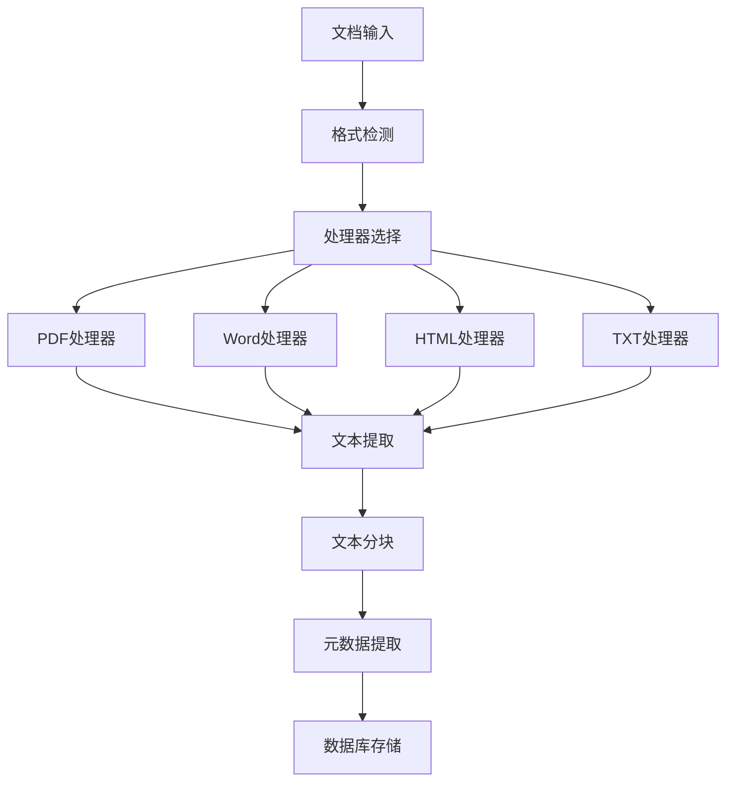

# 第十二节课：多文档源处理 - 教师讲义

## 课程信息
- **课程时长**：45分钟
- **课程结构**：15分钟理论讲解 + 15分钟演示操作 + 15分钟学生实验
- **课程目标**：支持多文档格式和来源，统一处理接口
- **前置知识**：文档解析、文本分块、数据库操作

## 1. 课程概述（2分钟）

### 1.1 什么是多文档源处理
多文档源处理是指RAG系统能够处理不同格式的文档（PDF、Word、TXT、HTML等），并将它们统一转换为可检索的文本块的技术。这是构建实用RAG系统的关键能力。

### 1.2 为什么需要多文档源处理
- **格式多样性**：企业文档通常包含多种格式
- **统一接口**：简化上层应用的调用复杂度
- **扩展性**：便于后续添加新的文档格式支持
- **可靠性**：统一的错误处理和日志机制

## 2. 核心技术原理（8分钟）

### 2.1 文档格式解析技术

#### PDF文档解析
```python
# 使用PyMuPDF (fitz)进行PDF解析
import fitz

def parse_pdf(file_path: str) -> str:
    doc = fitz.open(file_path)
    text = ""
    for page in doc:
        text += page.get_text()
    doc.close()
    return text
```

**PDF解析特点**：
- 支持文本提取和图像识别
- 保留页面结构信息
- 处理加密和权限保护

#### Word文档解析
```python
# 使用python-docx处理Word文档
import docx

def parse_docx(file_path: str) -> str:
    doc = docx.Document(file_path)
    text = ""
    for paragraph in doc.paragraphs:
        text += paragraph.text + "\n"
    return text
```

**Word解析特点**：
- 提取段落和表格内容
- 保留格式信息
- 处理嵌入对象

#### HTML文档解析
```python
# 使用BeautifulSoup处理HTML
from bs4 import BeautifulSoup

def parse_html(file_path: str) -> str:
    with open(file_path, 'r', encoding='utf-8') as f:
        soup = BeautifulSoup(f.read(), 'html.parser')
    return soup.get_text()
```

### 2.2 统一处理接口设计

#### 文档处理器基类
```python
from abc import ABC, abstractmethod
from typing import Dict, Any

class DocumentProcessor(ABC):
    @abstractmethod
    def can_process(self, file_path: str) -> bool:
        """判断是否能处理该文件"""
        pass
    
    @abstractmethod
    def process(self, file_path: str) -> Dict[str, Any]:
        """处理文档并返回结构化数据"""
        pass
```

#### 处理器工厂模式
```python
class DocumentProcessorFactory:
    def __init__(self):
        self.processors = []
    
    def register(self, processor: DocumentProcessor):
        self.processors.append(processor)
    
    def get_processor(self, file_path: str) -> DocumentProcessor:
        for processor in self.processors:
            if processor.can_process(file_path):
                return processor
        raise ValueError(f"No processor found for {file_path}")
```

### 2.3 批量处理优化策略

#### 并发处理
```python
import concurrent.futures
from pathlib import Path

def batch_process_documents(directory: str, max_workers: int = 4):
    files = list(Path(directory).glob("*.*"))
    
    with concurrent.futures.ThreadPoolExecutor(max_workers=max_workers) as executor:
        futures = {executor.submit(process_single_file, file): file for file in files}
        
        for future in concurrent.futures.as_completed(futures):
            file = futures[future]
            try:
                result = future.result()
                print(f"Processed {file}: {len(result)} characters")
            except Exception as e:
                print(f"Error processing {file}: {e}")
```

#### 内存管理
- 大文件分块处理
- 及时释放资源
- 监控内存使用

### 2.4 错误处理机制

#### 分层错误处理
```python
import logging
from enum import Enum

class ProcessingError(Exception):
    def __init__(self, message: str, error_type: str, file_path: str):
        self.message = message
        self.error_type = error_type
        self.file_path = file_path
        super().__init__(self.message)

class ErrorType(Enum):
    FILE_NOT_FOUND = "FILE_NOT_FOUND"
    UNSUPPORTED_FORMAT = "UNSUPPORTED_FORMAT"
    PARSING_ERROR = "PARSING_ERROR"
    ENCODING_ERROR = "ENCODING_ERROR"
```

#### 日志记录策略
```python
def setup_logging():
    logging.basicConfig(
        level=logging.INFO,
        format='%(asctime)s - %(name)s - %(levelname)s - %(message)s',
        handlers=[
            logging.FileHandler('document_processing.log'),
            logging.StreamHandler()
        ]
    )
```

## 3. 实现架构设计（3分钟）

### 3.1 系统架构图


### 3.2 核心组件
1. **文档检测器**：识别文件格式
2. **处理器工厂**：选择合适的处理器
3. **文本提取器**：统一文本提取接口
4. **元数据管理器**：提取和管理文档元数据
5. **错误处理器**：统一错误处理和日志

### 3.3 性能优化要点
- **并发处理**：多线程/多进程处理
- **缓存机制**：避免重复处理
- **流式处理**：大文件分块处理
- **资源管理**：及时释放文件句柄

## 4. 演示操作要点（2分钟）

### 4.1 演示流程
1. 展示不同格式文档的处理
2. 演示批量处理功能
3. 展示错误处理和日志
4. 演示性能监控

### 4.2 关键演示点
- 统一接口的便利性
- 错误处理的健壮性
- 批量处理的效率
- 日志信息的完整性

## 5. 学生实验指导要点

### 5.1 实验目标
- 实现多格式文档处理器
- 构建统一处理接口
- 添加错误处理和日志
- 测试批量处理功能

### 5.2 实验重点
- 理解工厂模式的应用
- 掌握并发处理技术
- 学会错误处理设计
- 体验性能优化方法

## 6. 常见问题与解答

### Q1: 如何处理加密的PDF文档？
A: 使用PyMuPDF的密码参数，或提示用户提供密码。

### Q2: 大文件处理时内存不足怎么办？
A: 采用流式处理，分块读取和处理文档内容。

### Q3: 如何保证处理结果的一致性？
A: 统一文本清洗规则，标准化输出格式。

### Q4: 如何扩展支持新的文档格式？
A: 实现DocumentProcessor接口，注册到工厂类中。

## 7. 课程总结

本节课学习了多文档源处理的核心技术，包括：
- 多格式文档解析技术
- 统一处理接口设计
- 批量处理优化策略
- 错误处理和日志机制

这些技术为构建实用的RAG系统奠定了坚实基础，使系统能够处理企业环境中的各种文档格式。