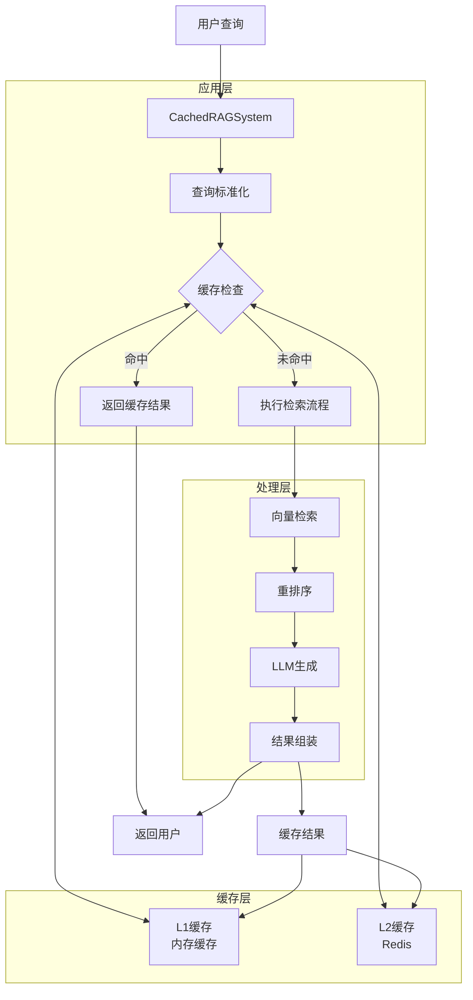
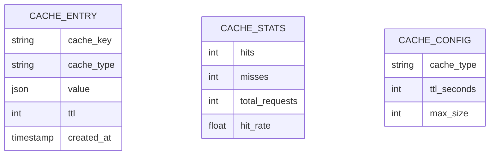

# 第十四节课：缓存策略 - 技术架构

## 1. 架构设计

## 2. 技术描述

- **前端**: 无（命令行界面）
- **后端**: Python 3.8+
- **缓存**: Redis 6.0+
- **依赖**:
  - redis==5.0.0
  - hiredis==2.2.3 (可选，提升性能)

## 3. 核心组件

### 3.1 CacheManager

多层缓存管理器，负责缓存的读写、失效和统计。

**主要功能**:
- L1缓存(内存)管理
- L2缓存(Redis)管理
- 缓存键生成与标准化
- TTL(生存时间)管理
- LRU淘汰策略
- 缓存统计收集

### 3.2 CachedRAGSystem

集成缓存的RAG系统，负责协调缓存和检索流程。

**主要功能**:
- 查询标准化
- 多级缓存查询
- 向量检索与重排序
- LLM生成调用
- 结果缓存管理

## 4. 数据模型

### 4.1 缓存数据结构

### 4.2 缓存键设计

缓存键格式: `{cache_type}:{hash}`

**示例**:
- `query_result:5a105e8b9d40e1329780d62ea2265d8a`
- `vector_search:8b1a9953c4611296a827abf8c47804d7`
- `rerank_scores:7b52009b64fd0a2a49e6d8a939753077`

## 5. 缓存策略

### 5.1 TTL配置

| 缓存类型 | TTL (秒) | 说明 |
|---------|---------|------|
| query_result | 3600 | 完整查询结果缓存1小时 |
| vector_search | 7200 | 向量检索结果缓存2小时 |
| document_content | 86400 | 文档内容缓存24小时 |
| rerank_scores | 1800 | 重排序分数缓存30分钟 |

### 5.2 淘汰策略

- **L1缓存**: 基于容量的FIFO淘汰
- **L2缓存**: 基于TTL的自动过期

## 6. 性能优化

### 6.1 查询标准化

通过标准化查询文本提高缓存命中率:
- 统一大小写
- 去除多余空格
- 去除标点符号

### 6.2 多级缓存

- **L1缓存**: 内存缓存，访问速度最快
- **L2缓存**: Redis缓存，容量更大，持久化

### 6.3 部分结果缓存

分层缓存不同处理阶段的结果:
- 向量检索结果缓存
- 重排序结果缓存
- 完整查询结果缓存

## 7. 监控与统计

### 7.1 缓存指标

- **命中率**: 缓存命中次数 / 总请求次数
- **响应时间**: 平均查询响应时间
- **内存使用**: L1缓存大小
- **Redis状态**: 连接状态和可用性

### 7.2 性能对比

| 指标 | 无缓存 | 有缓存 | 提升 |
|------|-------|-------|------|
| 平均响应时间 | ~1.8秒 | ~0.3秒 | ~83% |
| 重复查询时间 | ~1.8秒 | ~0.05秒 | ~97% |
| 系统吞吐量 | 基准 | 提升3-5倍 | 300-500% |

## 8. 扩展性考虑

### 8.1 水平扩展

- Redis集群配置
- 分片策略设计
- 一致性哈希实现

### 8.2 高可用性

- Redis主从复制
- 哨兵模式监控
- 故障自动转移

### 8.3 未来优化方向

- 智能TTL动态调整
- 基于访问频率的缓存预热
- 分布式缓存同步机制
- 缓存穿透和缓存雪崩防护