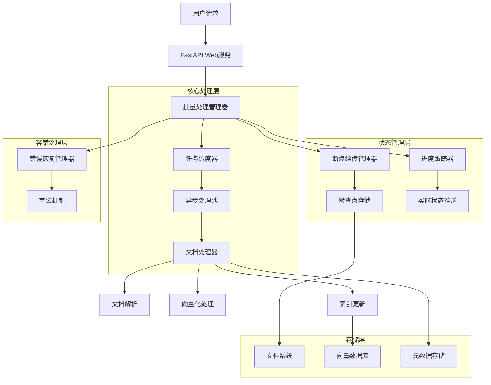
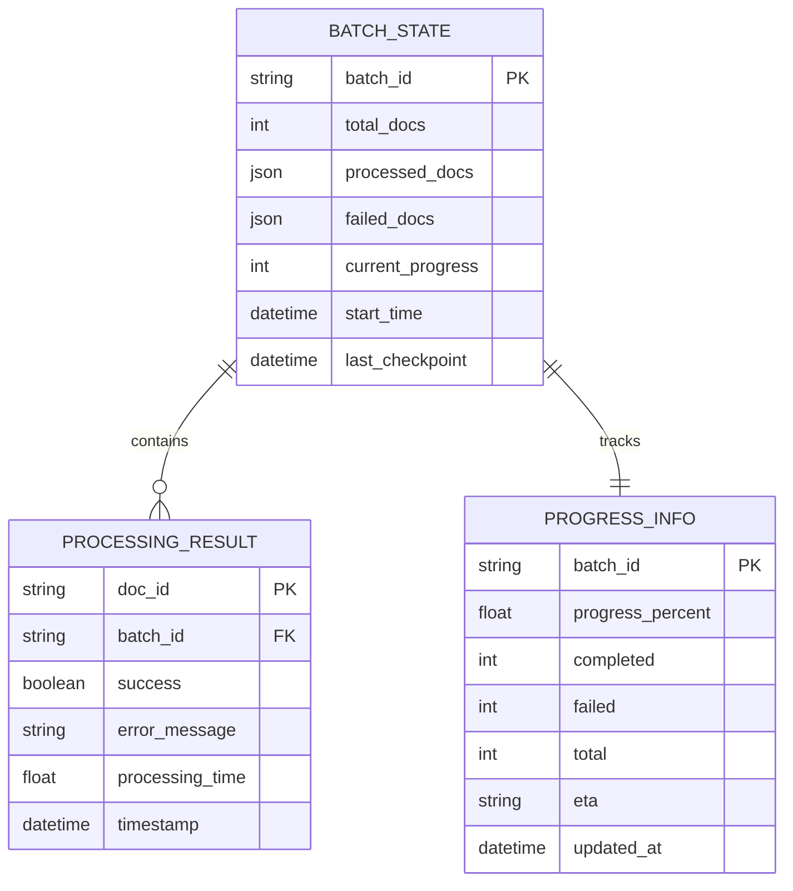
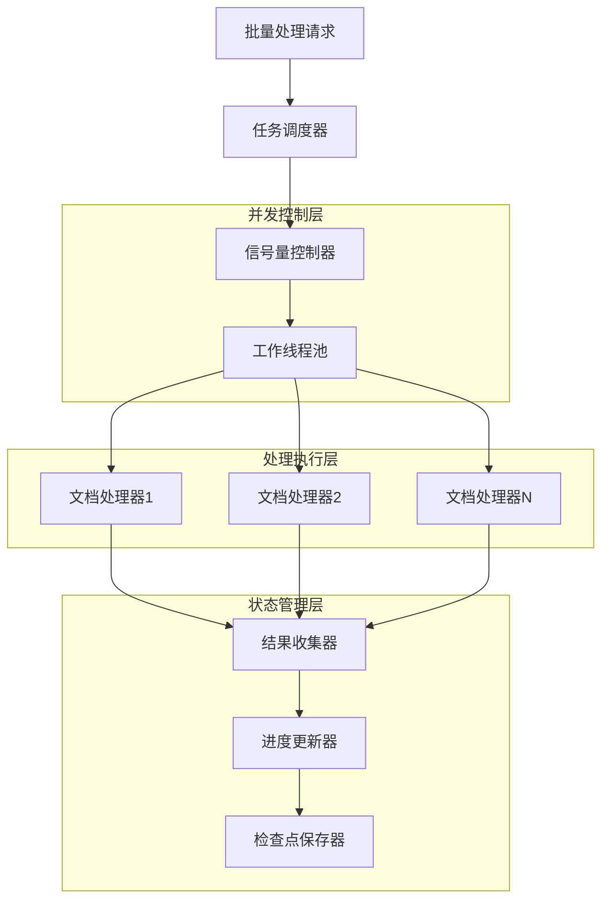
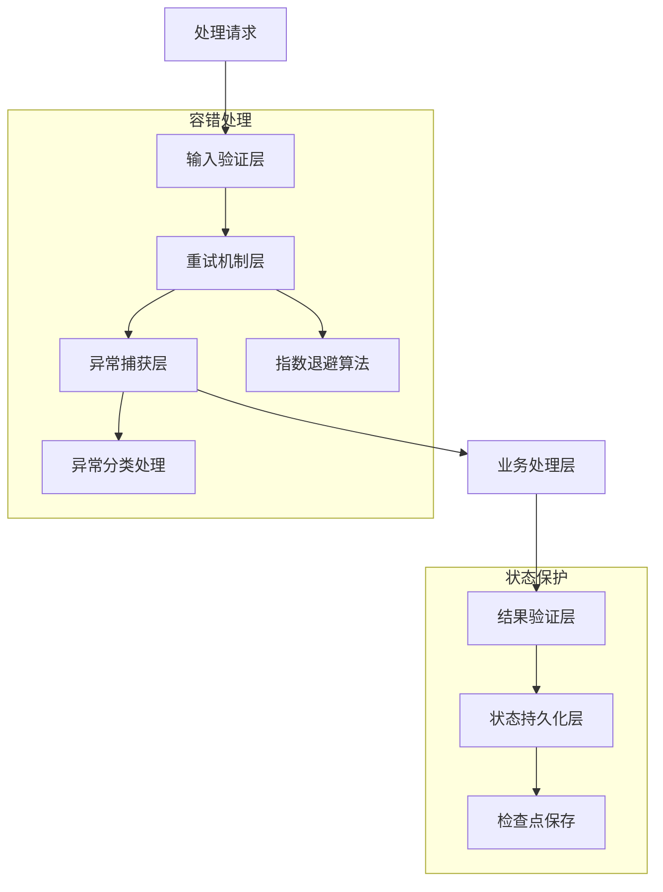
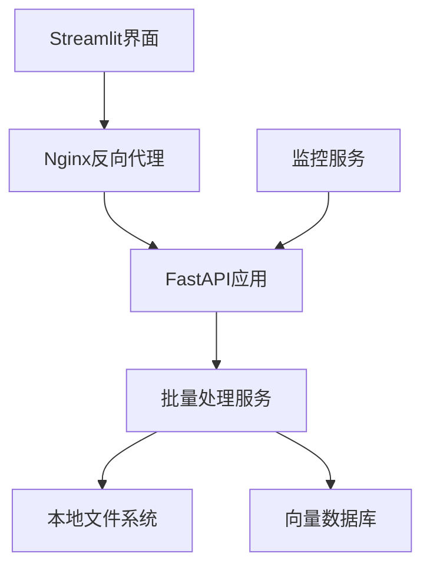
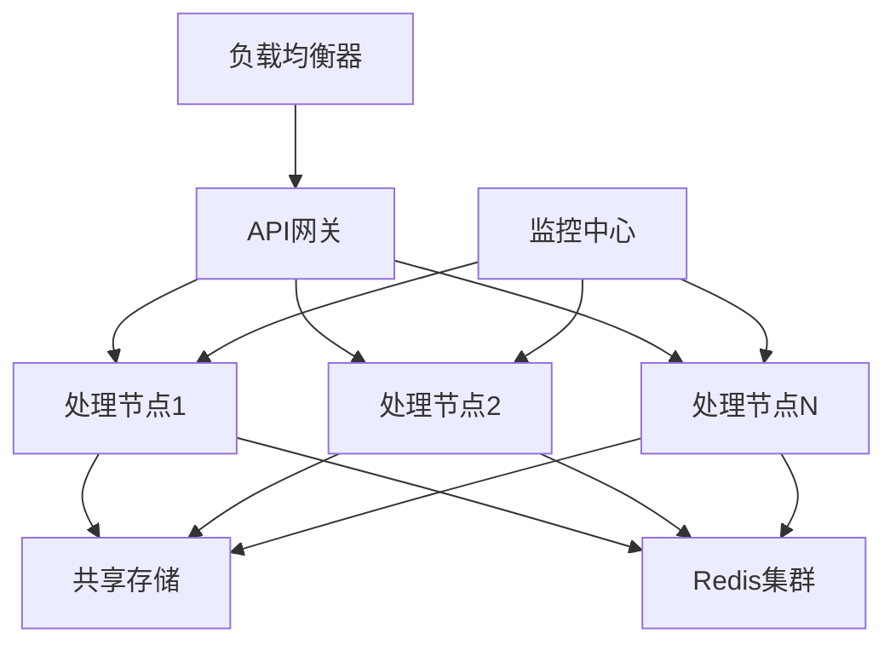

# 第15节课：批量/断点续传 - 技术架构文档

## 1. 架构设计



## 2. 技术描述

- **前端**: Streamlit Web界面 + FastAPI REST API
- **后端**: Python asyncio + FastAPI Background Tasks
- **存储**: 文件系统（检查点） + 向量数据库（Chroma/FAISS）
- **并发控制**: asyncio.Semaphore + 任务队列
- **状态管理**: JSON文件存储 + 内存缓存

## 3. 核心组件设计

### 3.1 批量处理管理器 (BatchProcessor)

```python
class BatchProcessor:
    """
    批量处理核心管理器
    负责协调各个子组件，管理整个批量处理流程
    """
    
    def __init__(self, max_concurrent: int = 10, checkpoint_interval: int = 10):
        self.max_concurrent = max_concurrent  # 最大并发数
        self.checkpoint_interval = checkpoint_interval  # 检查点间隔
        self.checkpoint_manager = CheckpointManager()
        self.error_recovery = ErrorRecoveryManager()
        self.active_batches = {}  # 活跃批次管理
    
    async def process_batch(self, doc_paths: List[str], batch_id: str = None, 
                          resume: bool = False) -> Dict[str, Any]:
        """
        批量处理主入口
        支持新建任务和恢复任务
        """
        pass
```

### 3.2 断点续传管理器 (CheckpointManager)

```python
class CheckpointManager:
    """
    断点续传管理器
    负责保存和恢复处理状态
    """
    
    def __init__(self, checkpoint_dir: str = "checkpoints"):
        self.checkpoint_dir = Path(checkpoint_dir)
        self.checkpoint_dir.mkdir(exist_ok=True)
    
    async def save_checkpoint(self, state: BatchState):
        """保存检查点到持久化存储"""
        pass
    
    async def load_checkpoint(self, batch_id: str) -> Optional[BatchState]:
        """从持久化存储加载检查点"""
        pass
```

### 3.3 进度跟踪器 (ProgressTracker)

```python
class ProgressTracker:
    """
    进度跟踪器
    提供实时进度更新和ETA计算
    """
    
    def __init__(self, total_items: int, batch_id: str):
        self.total_items = total_items
        self.completed_items = 0
        self.failed_items = 0
        self.batch_id = batch_id
        self.start_time = datetime.now()
        self.callbacks = []  # 进度更新回调
    
    async def update_progress(self, success: bool = True, doc_id: str = None):
        """更新进度并触发回调"""
        pass
    
    def get_eta(self) -> str:
        """计算预计剩余时间"""
        pass
```

### 3.4 错误恢复管理器 (ErrorRecoveryManager)

```python
class ErrorRecoveryManager:
    """
    错误恢复管理器
    实现重试机制和错误处理策略
    """
    
    def __init__(self, max_retries: int = 3, retry_delay: float = 1.0):
        self.max_retries = max_retries
        self.retry_delay = retry_delay
    
    async def execute_with_retry(self, func, *args, **kwargs) -> Any:
        """带重试机制的函数执行"""
        # 实现指数退避重试策略
        pass
```

## 4. 数据模型设计

### 4.1 数据模型定义



### 4.2 数据定义语言

```python
# 批处理状态表
@dataclass
class BatchState:
    batch_id: str
    total_docs: int
    processed_docs: List[str]
    failed_docs: List[str]
    current_progress: int
    start_time: str
    last_checkpoint: str

# 处理结果表
@dataclass
class ProcessingResult:
    doc_id: str
    success: bool
    error_message: Optional[str] = None
    processing_time: float = 0.0
    timestamp: str = None

# 进度信息表
@dataclass
class ProgressInfo:
    batch_id: str
    progress_percent: float
    completed: int
    failed: int
    total: int
    eta: str
    updated_at: str
```

## 5. API接口设计

### 5.1 核心API

**启动批量处理**
```
POST /batch/process
```

Request:
| 参数名 | 参数类型 | 是否必需 | 描述 |
|--------|----------|----------|------|
| doc_paths | List[str] | true | 文档路径列表 |
| batch_id | str | false | 批次ID（可选） |

Response:
| 参数名 | 参数类型 | 描述 |
|--------|----------|------|
| message | str | 响应消息 |
| batch_id | str | 批次ID |
| total_files | int | 文件总数 |

Example:
```json
{
  "doc_paths": ["/path/to/doc1.txt", "/path/to/doc2.txt"],
  "batch_id": "optional-batch-id"
}
```

**恢复批量处理**
```
POST /batch/resume/{batch_id}
```

Request:
| 参数名 | 参数类型 | 是否必需 | 描述 |
|--------|----------|----------|------|
| batch_id | str | true | 要恢复的批次ID |
| doc_paths | List[str] | true | 原始文档路径列表 |

Response:
| 参数名 | 参数类型 | 描述 |
|--------|----------|------|
| message | str | 响应消息 |
| batch_id | str | 批次ID |

**查询批处理状态**
```
GET /batch/status/{batch_id}
```

Response:
| 参数名 | 参数类型 | 描述 |
|--------|----------|------|
| batch_id | str | 批次ID |
| total_docs | int | 总文档数 |
| processed_docs | int | 已处理文档数 |
| failed_docs | int | 失败文档数 |
| progress_percent | float | 进度百分比 |
| eta | str | 预计剩余时间 |

**获取活跃批次**
```
GET /batch/active
```

Response:
| 参数名 | 参数类型 | 描述 |
|--------|----------|------|
| active_batches | List[BatchStatus] | 活跃批次列表 |
| total_count | int | 活跃批次总数 |

## 6. 并发控制策略

### 6.1 并发控制架构



### 6.2 并发控制实现

```python
# 使用信号量控制并发数量
semaphore = asyncio.Semaphore(max_concurrent)

async def process_with_semaphore(doc_path: str) -> ProcessingResult:
    async with semaphore:
        return await process_document(doc_path)

# 批量创建任务
tasks = [process_with_semaphore(doc_path) for doc_path in doc_paths]

# 使用as_completed获取完成的任务
for completed_task in asyncio.as_completed(tasks):
    result = await completed_task
    # 处理结果和更新进度
    await update_progress(result)
```

## 7. 容错机制设计

### 7.1 多层容错架构



### 7.2 错误分类和处理策略

| 错误类型 | 处理策略 | 重试次数 | 退避策略 |
|----------|----------|----------|----------|
| 网络超时 | 重试 | 3次 | 指数退避 |
| 文件不存在 | 跳过 | 0次 | 无 |
| 内存不足 | 等待重试 | 5次 | 线性退避 |
| 解析错误 | 记录跳过 | 1次 | 固定延迟 |
| 系统错误 | 中断任务 | 0次 | 无 |

## 8. 性能优化策略

### 8.1 内存管理
- **流式处理**: 避免同时加载大量文档到内存
- **对象池**: 重用文档处理器对象
- **垃圾回收**: 及时释放处理完成的文档对象

### 8.2 I/O优化
- **异步I/O**: 使用aiofiles进行异步文件操作
- **批量写入**: 批量更新向量数据库
- **缓存机制**: 缓存频繁访问的元数据

### 8.3 并发优化
- **动态调整**: 根据系统负载动态调整并发数
- **任务分片**: 将大任务分解为小任务
- **负载均衡**: 在多个处理节点间分配任务

## 9. 监控和日志

### 9.1 监控指标
- **吞吐量**: 每秒处理文档数
- **成功率**: 成功处理的文档比例
- **平均处理时间**: 单个文档的平均处理时间
- **资源使用率**: CPU、内存、磁盘使用情况
- **错误分布**: 不同类型错误的发生频率

### 9.2 日志策略
- **结构化日志**: 使用JSON格式记录结构化信息
- **分级日志**: DEBUG、INFO、WARNING、ERROR不同级别
- **异步日志**: 避免日志写入阻塞主处理流程
- **日志轮转**: 定期轮转日志文件，避免文件过大

## 10. 扩展性设计

### 10.1 水平扩展
- **任务队列**: 使用Redis/RabbitMQ实现分布式任务队列
- **负载均衡**: 多个处理节点间的任务分配
- **状态同步**: 分布式环境下的状态一致性

### 10.2 插件化架构
- **处理器插件**: 支持不同类型文档的处理器
- **存储插件**: 支持不同的存储后端
- **通知插件**: 支持不同的进度通知方式

## 11. 安全考虑

### 11.1 访问控制
- **身份认证**: API访问的身份验证
- **权限控制**: 不同用户的操作权限
- **资源隔离**: 不同用户的任务和数据隔离

### 11.2 数据安全
- **敏感数据**: 处理过程中的敏感数据保护
- **传输加密**: API通信的加密保护
- **存储加密**: 检查点数据的加密存储

## 12. 部署架构

### 12.1 单机部署


### 12.2 分布式部署


这个技术架构文档为第15节课的批量处理和断点续传系统提供了完整的技术设计方案，涵盖了架构设计、核心组件、数据模型、API接口、并发控制、容错机制、性能优化、监控日志、扩展性和安全等各个方面。