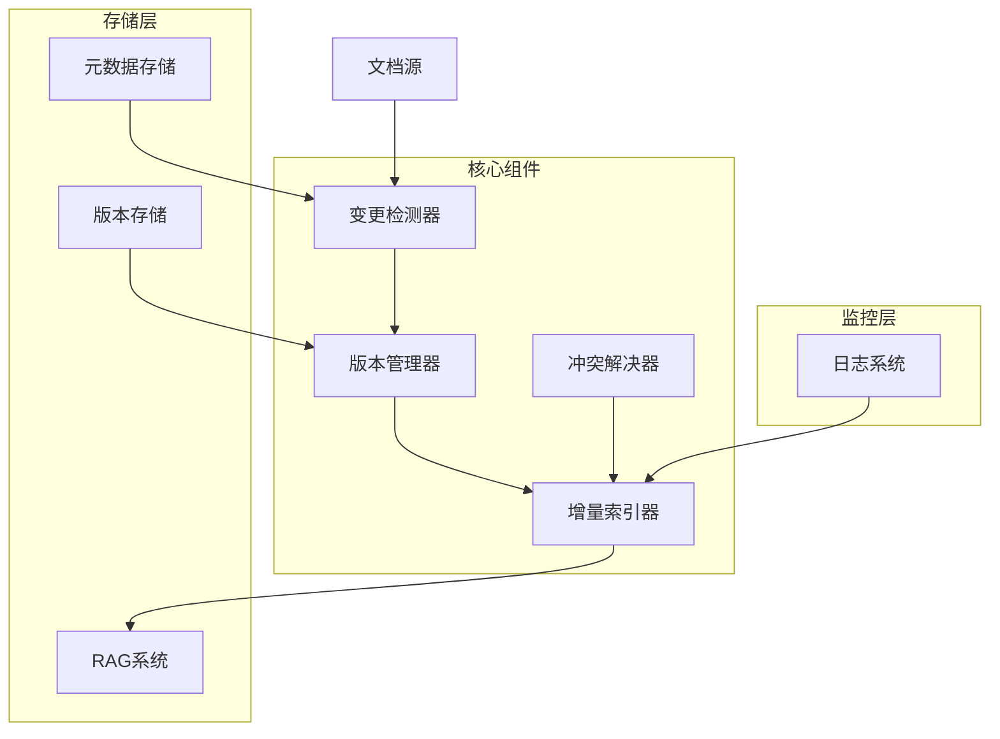
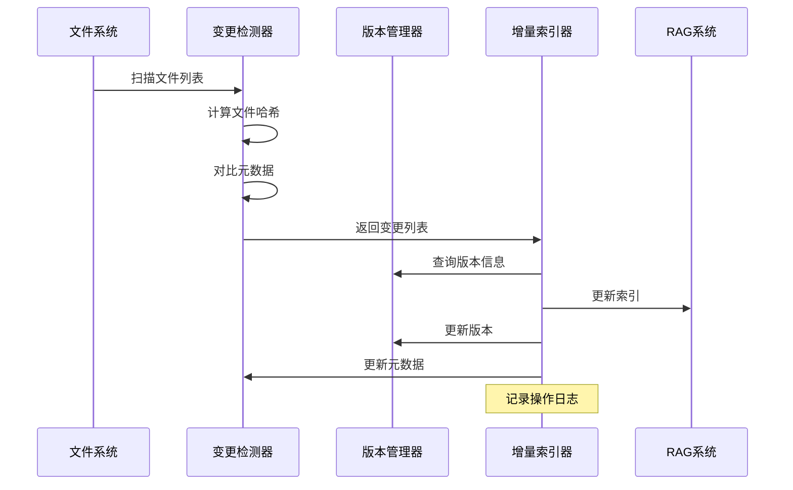
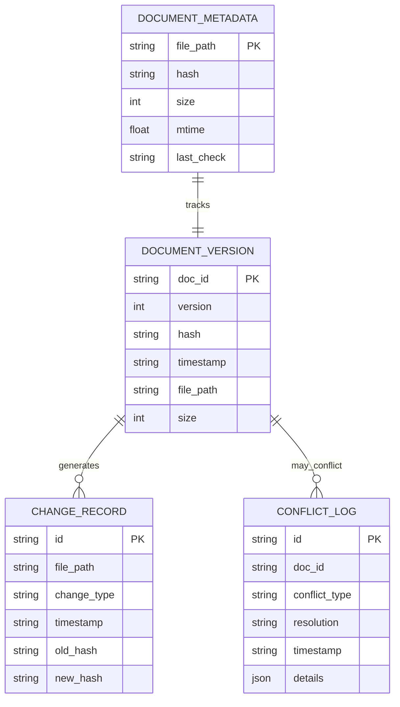
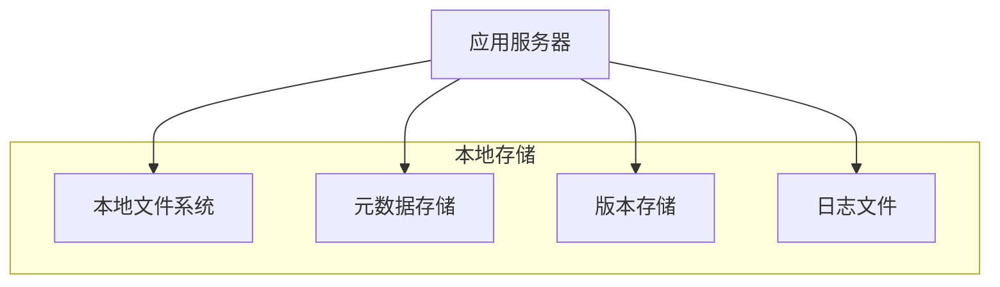
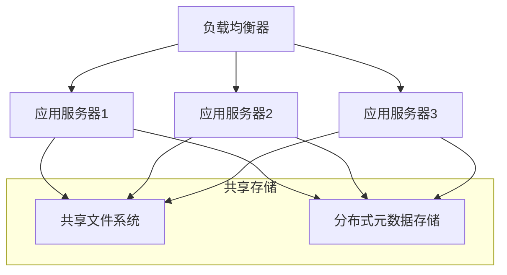

# 第16节课：增量更新 - 技术架构文档

## 1. 架构设计

### 1.1 系统架构图



### 1.2 组件交互流程



## 2. 技术描述

### 2.1 核心技术栈
- **语言**: Python 3.8+
- **哈希算法**: MD5 (可扩展为SHA256)
- **数据序列化**: JSON
- **日志系统**: Python logging
- **文件监控**: watchdog (可选)
- **并发处理**: asyncio/threading (可选)

### 2.2 依赖库
```python
# 核心依赖
import hashlib      # 哈希计算
import json         # 数据序列化
import os           # 文件系统操作
import logging      # 日志记录
from datetime import datetime  # 时间处理
from typing import Dict, List, Optional  # 类型注解
from dataclasses import dataclass  # 数据类

# 可选依赖
# watchdog>=2.1.0    # 文件系统监控
# asyncio            # 异步处理
```

## 3. 路由定义

### 3.1 核心API接口

| 接口 | 方法 | 描述 |
|------|------|------|
| `/api/incremental/scan` | POST | 扫描并检测文件变更 |
| `/api/incremental/update` | POST | 执行增量更新 |
| `/api/incremental/status` | GET | 获取系统状态 |
| `/api/incremental/versions` | GET | 获取版本信息 |
| `/api/incremental/metadata` | GET | 获取元数据信息 |

### 3.2 内部方法接口

| 类 | 方法 | 描述 |
|----|------|------|
| ChangeDetector | `detect_changes()` | 检测文件变更 |
| ChangeDetector | `calculate_file_hash()` | 计算文件哈希 |
| VersionManager | `update_version()` | 更新版本信息 |
| VersionManager | `get_version()` | 获取版本信息 |
| IncrementalIndexer | `update_index()` | 执行增量更新 |
| ConflictResolver | `resolve_conflict()` | 解决版本冲突 |

## 4. API定义

### 4.1 扫描文件变更

**接口**: `POST /api/incremental/scan`

**请求参数**:
| 参数名 | 类型 | 必填 | 描述 |
|--------|------|------|------|
| file_paths | List[str] | 是 | 要扫描的文件路径列表 |
| force_scan | bool | 否 | 是否强制重新扫描 |

**响应**:
| 参数名 | 类型 | 描述 |
|--------|------|------|
| status | str | 操作状态 |
| changes | Dict | 变更统计信息 |
| details | List | 详细变更列表 |

**示例**:
```json
{
  "file_paths": [
    "/path/to/doc1.txt",
    "/path/to/doc2.txt"
  ],
  "force_scan": false
}
```

**响应示例**:
```json
{
  "status": "success",
  "changes": {
    "added": 2,
    "modified": 1,
    "deleted": 0,
    "unchanged": 5
  },
  "details": [
    {
      "file_path": "/path/to/doc1.txt",
      "change_type": "added",
      "hash": "d41d8cd98f00b204e9800998ecf8427e"
    }
  ]
}
```

### 4.2 执行增量更新

**接口**: `POST /api/incremental/update`

**请求参数**:
| 参数名 | 类型 | 必填 | 描述 |
|--------|------|------|------|
| file_paths | List[str] | 是 | 要更新的文件路径列表 |
| batch_size | int | 否 | 批处理大小，默认100 |
| conflict_strategy | str | 否 | 冲突解决策略 |

**响应**:
| 参数名 | 类型 | 描述 |
|--------|------|------|
| status | str | 操作状态 |
| results | Dict | 更新结果统计 |
| errors | List | 错误信息列表 |
| duration | float | 执行耗时（秒） |

### 4.3 获取系统状态

**接口**: `GET /api/incremental/status`

**响应**:
```json
{
  "status": "running",
  "total_documents": 1500,
  "total_versions": 1500,
  "metadata_files": 1500,
  "last_update": "2024-01-15T10:30:00Z",
  "update_frequency": "每小时",
  "storage_usage": {
    "metadata_size": "2.5MB",
    "version_size": "1.8MB"
  }
}
```

## 5. 数据模型

### 5.1 核心数据结构



### 5.2 数据定义语言

#### 文档元数据表 (doc_metadata.json)
```json
{
  "file_path": {
    "path": "string",
    "size": "integer",
    "mtime": "float",
    "hash": "string",
    "last_check": "string (ISO datetime)"
  }
}
```

#### 版本信息表 (versions.json)
```json
{
  "doc_id": {
    "doc_id": "string",
    "version": "integer",
    "hash": "string",
    "timestamp": "string (ISO datetime)",
    "file_path": "string",
    "size": "integer"
  }
}
```

#### 变更记录表 (changes.json)
```json
{
  "change_id": {
    "file_path": "string",
    "change_type": "string (added|modified|deleted)",
    "timestamp": "string (ISO datetime)",
    "old_hash": "string",
    "new_hash": "string",
    "old_size": "integer",
    "new_size": "integer"
  }
}
```

### 5.3 配置数据结构

```python
@dataclass
class IncrementalConfig:
    """增量更新配置"""
    metadata_file: str = "doc_metadata.json"
    version_file: str = "versions.json"
    change_log_file: str = "changes.json"
    conflict_strategy: str = "timestamp"  # timestamp|version|size|local
    batch_size: int = 100
    hash_algorithm: str = "md5"  # md5|sha256
    enable_logging: bool = True
    log_level: str = "INFO"
    max_log_size: int = 10 * 1024 * 1024  # 10MB
    backup_count: int = 5
```

## 6. 核心算法

### 6.1 变更检测算法

```python
def detect_changes_algorithm(current_files: Set[str], 
                           metadata: Dict[str, Dict]) -> Dict[str, List[str]]:
    """
    变更检测算法
    
    时间复杂度: O(n) - n为文件数量
    空间复杂度: O(n) - 存储文件信息
    """
    previous_files = set(metadata.keys())
    
    # 集合运算检测变更
    added = current_files - previous_files      # O(n)
    deleted = previous_files - current_files    # O(n)
    potential_modified = current_files & previous_files  # O(n)
    
    modified = []
    unchanged = []
    
    # 检测修改文件 - O(m), m为交集大小
    for file_path in potential_modified:
        current_hash = calculate_file_hash(file_path)
        previous_hash = metadata[file_path].get('hash', '')
        
        if current_hash != previous_hash:
            modified.append(file_path)
        else:
            unchanged.append(file_path)
    
    return {
        'added': list(added),
        'modified': modified,
        'deleted': list(deleted),
        'unchanged': unchanged
    }
```

### 6.2 哈希计算优化

```python
def optimized_hash_calculation(file_path: str, 
                              chunk_size: int = 4096,
                              max_size: int = None) -> str:
    """
    优化的哈希计算
    
    - 分块读取，减少内存占用
    - 可选择只计算文件前N字节
    - 支持大文件处理
    """
    hash_obj = hashlib.md5()
    total_read = 0
    
    try:
        with open(file_path, 'rb') as f:
            while True:
                chunk = f.read(chunk_size)
                if not chunk:
                    break
                
                hash_obj.update(chunk)
                total_read += len(chunk)
                
                # 如果设置了最大大小限制
                if max_size and total_read >= max_size:
                    break
        
        return hash_obj.hexdigest()
    except (IOError, OSError) as e:
        logger.error(f"计算文件哈希失败 {file_path}: {e}")
        return ""
```

### 6.3 批量更新算法

```python
def batch_update_algorithm(changes: Dict[str, List[str]], 
                          batch_size: int = 100) -> List[Dict]:
    """
    批量更新算法
    
    将变更按类型和大小分批处理，提高效率
    """
    batches = []
    
    # 按优先级处理：删除 -> 修改 -> 添加
    for change_type in ['deleted', 'modified', 'added']:
        files = changes.get(change_type, [])
        
        # 分批处理
        for i in range(0, len(files), batch_size):
            batch = {
                'type': change_type,
                'files': files[i:i + batch_size],
                'batch_id': f"{change_type}_{i // batch_size}"
            }
            batches.append(batch)
    
    return batches
```

## 7. 性能优化策略

### 7.1 缓存策略
- **哈希缓存**: 缓存最近计算的文件哈希值
- **元数据缓存**: 在内存中缓存常用元数据
- **LRU淘汰**: 使用LRU算法管理缓存

### 7.2 并发处理
- **多线程哈希计算**: 并行计算多个文件的哈希值
- **异步IO**: 使用异步IO处理文件读取
- **批量操作**: 将多个小操作合并为批量操作

### 7.3 存储优化
- **压缩存储**: 对元数据进行压缩存储
- **增量备份**: 只备份变更的元数据
- **定期清理**: 清理过期的版本信息

## 8. 监控与日志

### 8.1 关键指标
- **处理速度**: 每秒处理的文件数量
- **变更比例**: 变更文件占总文件的比例
- **错误率**: 处理失败的文件比例
- **存储使用**: 元数据和版本信息的存储占用

### 8.2 日志格式
```python
# 标准日志格式
log_format = {
    "timestamp": "2024-01-15T10:30:00Z",
    "level": "INFO",
    "component": "IncrementalIndexer",
    "operation": "update_index",
    "file_path": "/path/to/document.txt",
    "change_type": "modified",
    "duration": 0.15,
    "status": "success",
    "details": {
        "old_hash": "abc123",
        "new_hash": "def456",
        "size_change": 150
    }
}
```

### 8.3 告警规则
- **高错误率**: 错误率超过5%时告警
- **处理延迟**: 单次更新耗时超过10分钟告警
- **存储空间**: 元数据占用超过1GB告警
- **版本冲突**: 冲突频率异常时告警

## 9. 部署架构

### 9.1 单机部署


### 9.2 分布式部署


## 10. 安全考虑

### 10.1 数据安全
- **访问控制**: 限制对元数据文件的访问权限
- **数据加密**: 对敏感元数据进行加密存储
- **备份策略**: 定期备份元数据和版本信息

### 10.2 操作安全
- **权限验证**: 验证用户对文件的操作权限
- **操作审计**: 记录所有变更操作的审计日志
- **回滚机制**: 支持错误操作的快速回滚

## 11. 扩展性设计

### 11.1 插件化架构
- **哈希算法插件**: 支持不同的哈希算法
- **存储后端插件**: 支持不同的存储后端
- **冲突解决插件**: 支持自定义冲突解决策略

### 11.2 API扩展
- **Webhook支持**: 支持变更事件的Webhook通知
- **GraphQL接口**: 提供更灵活的查询接口
- **批量API**: 支持大规模批量操作

这个技术架构文档为增量更新系统提供了完整的技术规范，涵盖了从基础架构到高级特性的各个方面，为系统的实现和维护提供了详细的指导。